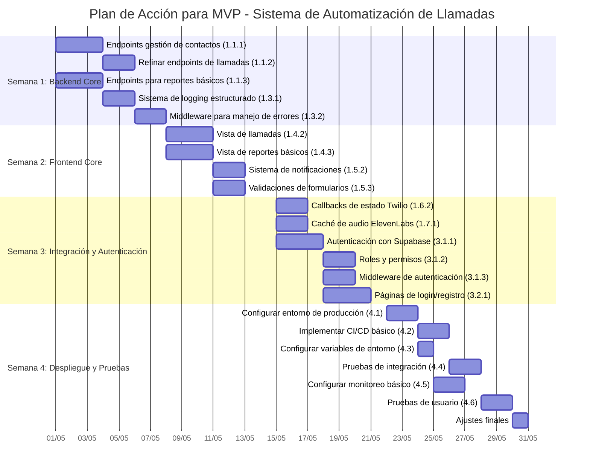

# Diagrama de Gantt - Plan de Acción MVP

## Leyenda

- **Semana 1 (01/05 - 07/05)**: Completar Backend Core
- **Semana 2 (08/05 - 14/05)**: Completar Frontend Core
- **Semana 3 (15/05 - 21/05)**: Integración y Autenticación
- **Semana 4 (22/05 - 28/05)**: Despliegue y Pruebas

## Notas

- Las fechas son estimativas y pueden ajustarse según el progreso real
- Algunas tareas pueden realizarse en paralelo si hay recursos disponibles
- Se recomienda realizar reuniones diarias de seguimiento para identificar y resolver bloqueos
- Al final de cada semana, se debe realizar una revisión del progreso y ajustar el plan si es necesario
