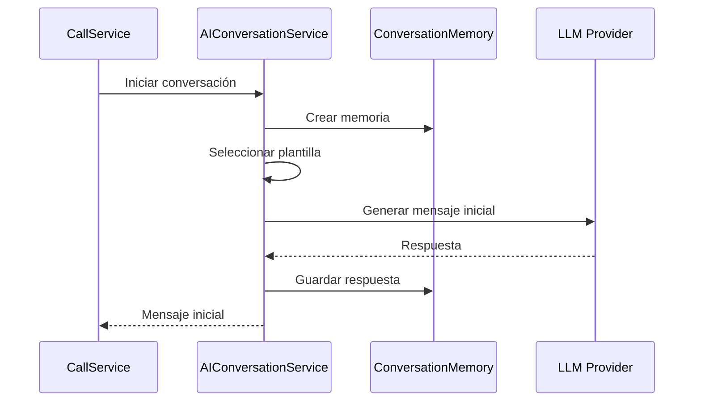
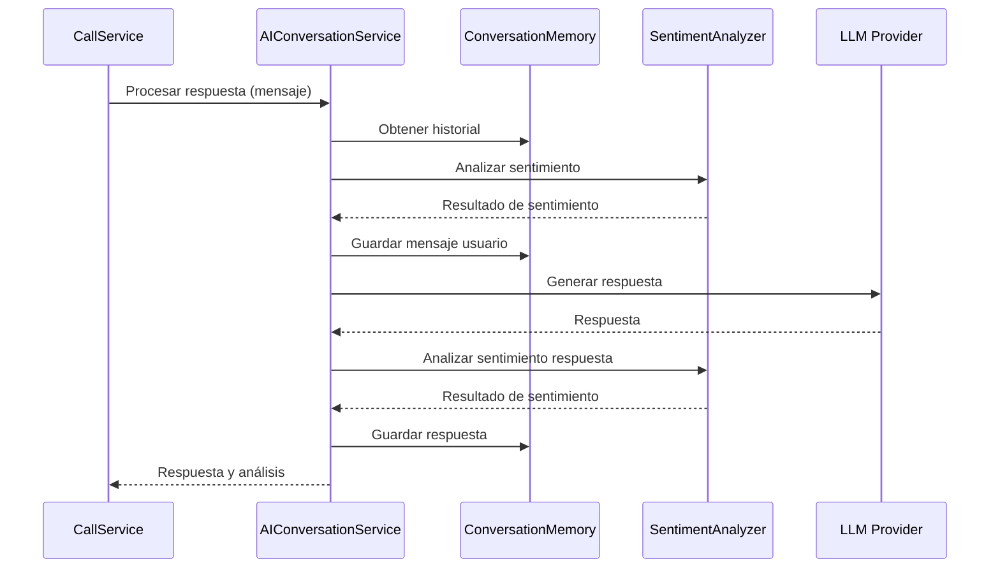

# Servicio de Conversación con IA - Sistema de Automatización de Llamadas

## Visión General

El Servicio de Conversación con IA es un componente central del Sistema de Automatización de Llamadas que permite mantener conversaciones naturales y contextuales con los destinatarios de las llamadas. Utiliza modelos avanzados de lenguaje para generar respuestas apropiadas, analizar sentimientos y proporcionar una experiencia conversacional fluida.

## Arquitectura

```
┌─────────────────┐     ┌─────────────────┐     ┌─────────────────┐
│                 │     │                 │     │                 │
│  CallService    │────▶│AIConversationSvc│────▶│  LangChain      │
│                 │     │                 │     │                 │
└─────────────────┘     └─────────────────┘     └────────┬────────┘
                                                         │
                                                         ▼
┌─────────────────┐     ┌─────────────────┐     ┌─────────────────┐
│                 │     │                 │     │                 │
│ ConversationMem │◀────│PromptTemplates  │◀────│  LLM Provider   │
│                 │     │                 │     │ (OpenAI/Google) │
└─────────────────┘     └─────────────────┘     └─────────────────┘
```

## Componentes Principales

### AIConversationService

El `AIConversationService` es el componente principal que orquesta la conversación con IA.

```python
class AIConversationService:
    def __init__(self, settings=None, cache_service=None):
        self.settings = settings or AISettings()
        self.cache_service = cache_service or CacheService()
        self.llm = self._initialize_llm()
        self.prompt_templates = self._load_prompt_templates()
        
    def _initialize_llm(self):
        """Inicializa el modelo de lenguaje."""
        if self.settings.LLM_PROVIDER == "openai":
            return ChatOpenAI(
                model_name=self.settings.DEFAULT_MODEL,
                temperature=self.settings.TEMPERATURE,
                max_tokens=self.settings.MAX_TOKENS,
                api_key=self.settings.OPENAI_API_KEY
            )
        elif self.settings.LLM_PROVIDER == "google":
            return ChatGoogleGenerativeAI(
                model=self.settings.DEFAULT_MODEL,
                temperature=self.settings.TEMPERATURE,
                max_output_tokens=self.settings.MAX_TOKENS,
                google_api_key=self.settings.GOOGLE_API_KEY
            )
        else:
            raise ValueError(f"Unsupported LLM provider: {self.settings.LLM_PROVIDER}")
    
    def _load_prompt_templates(self):
        """Carga las plantillas de prompts para diferentes tipos de campaña."""
        return {
            "sales": PromptTemplate(
                input_variables=["product", "objective", "key_points", "history"],
                template=self.settings.CAMPAIGN_PROMPTS["sales"]
            ),
            "support": PromptTemplate(
                input_variables=["product", "common_issues", "history"],
                template=self.settings.CAMPAIGN_PROMPTS["support"]
            ),
            "survey": PromptTemplate(
                input_variables=["topic", "key_questions", "history"],
                template=self.settings.CAMPAIGN_PROMPTS["survey"]
            )
        }
        
    async def generate_response(
        self,
        conversation_id: str,
        message: str,
        context: Dict[str, Any] = None,
        campaign_type: str = "sales"
    ) -> Dict[str, Any]:
        """
        Genera una respuesta basada en el mensaje del usuario y el contexto.
        
        Args:
            conversation_id: ID único de la conversación
            message: Mensaje del usuario
            context: Contexto adicional (nombre, campaña, etc.)
            campaign_type: Tipo de campaña (sales, support, survey)
            
        Returns:
            Dict con la respuesta y metadatos
        """
        # Implementación para generar respuesta
        
    async def analyze_sentiment(self, text: str) -> Dict[str, Any]:
        """
        Analiza el sentimiento de un texto.
        
        Args:
            text: Texto a analizar
            
        Returns:
            Dict con análisis de sentimiento
        """
        # Implementación para analizar sentimiento
```

### ConversationMemory

El `ConversationMemory` gestiona el historial y contexto de las conversaciones.

```python
class ConversationMemory:
    def __init__(self, cache_service=None):
        self.cache_service = cache_service or CacheService()
        
    async def get_memory(self, conversation_id: str) -> List[Dict[str, str]]:
        """
        Obtiene el historial de una conversación.
        
        Args:
            conversation_id: ID único de la conversación
            
        Returns:
            Lista de mensajes de la conversación
        """
        # Implementación para obtener memoria
        
    async def add_message(self, conversation_id: str, role: str, content: str) -> None:
        """
        Añade un mensaje al historial de la conversación.
        
        Args:
            conversation_id: ID único de la conversación
            role: Rol del mensaje (user, assistant)
            content: Contenido del mensaje
        """
        # Implementación para añadir mensaje
        
    async def clear_memory(self, conversation_id: str) -> None:
        """
        Limpia el historial de una conversación.
        
        Args:
            conversation_id: ID único de la conversación
        """
        # Implementación para limpiar memoria
```

## Flujos de Conversación

### 1. Iniciar Conversación



#### Código de Ejemplo

```python
async def start_conversation(campaign_id: str, contact_id: str, campaign_type: str = "sales") -> Dict[str, Any]:
    """
    Inicia una nueva conversación.
    
    Args:
        campaign_id: ID de la campaña
        contact_id: ID del contacto
        campaign_type: Tipo de campaña
        
    Returns:
        Dict con información de la conversación
    """
    # Generar ID de conversación
    conversation_id = f"{campaign_id}_{contact_id}_{int(time.time())}"
    
    # Obtener información de campaña y contacto
    campaign = await campaign_repository.find_by_id(campaign_id)
    contact = await contact_repository.find_by_id(contact_id)
    
    # Preparar contexto
    context = {
        "contact_name": contact.name,
        "campaign_name": campaign.name,
        "product": campaign.product,
        "objective": campaign.objective,
        "key_points": campaign.key_points
    }
    
    # Inicializar memoria de conversación
    memory = ConversationMemory()
    await memory.clear_memory(conversation_id)
    
    # Generar mensaje inicial
    response = await ai_conversation_service.generate_response(
        conversation_id=conversation_id,
        message="",  # Mensaje vacío para iniciar
        context=context,
        campaign_type=campaign_type
    )
    
    return {
        "conversation_id": conversation_id,
        "initial_message": response["response"],
        "sentiment": response["response_sentiment"]
    }
```

### 2. Procesar Respuesta del Usuario



#### Código de Ejemplo

```python
async def process_user_response(conversation_id: str, user_message: str) -> Dict[str, Any]:
    """
    Procesa la respuesta del usuario y genera una respuesta.
    
    Args:
        conversation_id: ID de la conversación
        user_message: Mensaje del usuario
        
    Returns:
        Dict con respuesta y metadatos
    """
    # Obtener contexto de la conversación
    conversation = await conversation_repository.find_by_id(conversation_id)
    if not conversation:
        raise ValueError(f"Conversation not found: {conversation_id}")
    
    # Analizar sentimiento del mensaje del usuario
    user_sentiment = await ai_conversation_service.analyze_sentiment(user_message)
    
    # Generar respuesta
    response = await ai_conversation_service.generate_response(
        conversation_id=conversation_id,
        message=user_message,
        context=conversation.context,
        campaign_type=conversation.campaign_type
    )
    
    # Guardar interacción
    await conversation_repository.add_interaction(
        conversation_id=conversation_id,
        user_message=user_message,
        user_sentiment=user_sentiment,
        assistant_message=response["response"],
        assistant_sentiment=response["response_sentiment"]
    )
    
    return {
        "response": response["response"],
        "user_sentiment": user_sentiment,
        "response_sentiment": response["response_sentiment"],
        "next_actions": response.get("suggested_actions", [])
    }
```

## Plantillas de Prompts

Las plantillas de prompts son fundamentales para guiar al modelo de lenguaje en la generación de respuestas apropiadas según el tipo de campaña.

### Plantilla para Campañas de Ventas

```
Eres un representante de ventas profesional y amable de {company_name} especializado en {product}.

Objetivo de la llamada: {objective}

Puntos clave a mencionar:
{key_points}

Información del cliente:
- Nombre: {contact_name}
- Historial: {contact_history}

Directrices:
1. Sé cordial y profesional en todo momento
2. Escucha activamente y responde a las preocupaciones
3. No seas agresivo ni insistente
4. Proporciona información precisa sobre el producto
5. Ofrece resolver dudas o programar una demostración

Historial de la conversación:
{history}

Respuesta del cliente: {input}

Tu respuesta:
```

### Plantilla para Campañas de Soporte

```
Eres un agente de soporte técnico experto y paciente de {company_name} especializado en {product}.

Problemas comunes que puedes resolver:
{common_issues}

Información del cliente:
- Nombre: {contact_name}
- Historial de soporte: {support_history}

Directrices:
1. Sé empático y comprensivo con el problema del cliente
2. Haz preguntas para entender mejor el problema si es necesario
3. Proporciona instrucciones claras y paso a paso
4. Verifica si el problema se ha resuelto
5. Ofrece escalamiento si no puedes resolver el problema

Historial de la conversación:
{history}

Mensaje del cliente: {input}

Tu respuesta:
```

### Plantilla para Campañas de Encuestas

```
Eres un encuestador profesional y amable que realiza una investigación sobre {topic}.

Preguntas clave de la encuesta:
{key_questions}

Información del participante:
- Nombre: {contact_name}

Directrices:
1. Sé respetuoso y agradece la participación
2. Mantén un tono neutral para no influir en las respuestas
3. Haz una pregunta a la vez
4. Aclara cualquier duda sobre las preguntas
5. No insistas si la persona no quiere responder alguna pregunta

Historial de la conversación:
{history}

Respuesta del participante: {input}

Tu respuesta:
```

## Análisis de Sentimientos

El análisis de sentimientos permite comprender la actitud y emoción del usuario durante la conversación, lo que ayuda a adaptar las respuestas y estrategias.

### Implementación

```python
async def analyze_sentiment(self, text: str) -> Dict[str, Any]:
    """
    Analiza el sentimiento de un texto.
    
    Args:
        text: Texto a analizar
        
    Returns:
        Dict con análisis de sentimiento
    """
    if not text:
        return {
            "sentiment": "neutral",
            "score": 0.0,
            "emotions": {
                "joy": 0.0,
                "sadness": 0.0,
                "anger": 0.0,
                "fear": 0.0,
                "surprise": 0.0
            }
        }
    
    # Usar LLM para análisis de sentimiento
    prompt = PromptTemplate(
        input_variables=["text"],
        template="""
        Analiza el sentimiento y las emociones en el siguiente texto:
        
        Texto: {text}
        
        Proporciona un análisis en formato JSON con la siguiente estructura:
        {{
            "sentiment": "positive/negative/neutral",
            "score": float entre -1.0 y 1.0,
            "emotions": {{
                "joy": float entre 0.0 y 1.0,
                "sadness": float entre 0.0 y 1.0,
                "anger": float entre 0.0 y 1.0,
                "fear": float entre 0.0 y 1.0,
                "surprise": float entre 0.0 y 1.0
            }},
            "explanation": "breve explicación del análisis"
        }}
        """
    )
    
    chain = LLMChain(
        llm=self.llm,
        prompt=prompt,
        output_parser=JsonOutputParser()
    )
    
    try:
        result = await chain.apredict(text=text)
        return result
    except Exception as e:
        logger.error(f"Error analyzing sentiment: {str(e)}")
        return {
            "sentiment": "neutral",
            "score": 0.0,
            "emotions": {
                "joy": 0.0,
                "sadness": 0.0,
                "anger": 0.0,
                "fear": 0.0,
                "surprise": 0.0
            },
            "explanation": "Error analyzing sentiment"
        }
```

### Interpretación de Resultados

| Sentimiento | Score      | Interpretación                                   | Acción Recomendada                           |
|-------------|------------|--------------------------------------------------|----------------------------------------------|
| Positive    | 0.5 a 1.0  | Usuario receptivo y satisfecho                   | Continuar con el script, ofrecer más información |
| Positive    | 0.1 a 0.5  | Usuario ligeramente positivo                     | Reforzar aspectos positivos, resolver dudas menores |
| Neutral     | -0.1 a 0.1 | Usuario neutral o indeciso                       | Proporcionar más información, destacar beneficios |
| Negative    | -0.5 a -0.1| Usuario ligeramente negativo o escéptico         | Abordar preocupaciones, ofrecer garantías    |
| Negative    | -1.0 a -0.5| Usuario muy negativo o molesto                   | Empatizar, ofrecer alternativas, considerar finalizar |

## Sugerencia de Acciones

El servicio puede sugerir acciones basadas en el contexto de la conversación y el análisis de sentimientos.

### Implementación

```python
async def suggest_actions(
    self,
    conversation_id: str,
    user_message: str,
    user_sentiment: Dict[str, Any],
    conversation_history: List[Dict[str, str]],
    context: Dict[str, Any]
) -> List[Dict[str, Any]]:
    """
    Sugiere acciones basadas en la conversación.
    
    Args:
        conversation_id: ID de la conversación
        user_message: Último mensaje del usuario
        user_sentiment: Análisis de sentimiento del usuario
        conversation_history: Historial de la conversación
        context: Contexto de la conversación
        
    Returns:
        Lista de acciones sugeridas
    """
    prompt = PromptTemplate(
        input_variables=["user_message", "sentiment", "history", "context"],
        template="""
        Basándote en la siguiente conversación y análisis de sentimiento, 
        sugiere las mejores acciones a tomar:
        
        Último mensaje del usuario: {user_message}
        
        Análisis de sentimiento: {sentiment}
        
        Historial de conversación:
        {history}
        
        Contexto:
        {context}
        
        Proporciona hasta 3 acciones recomendadas en formato JSON:
        [
            {{
                "action_type": "continue_conversation/offer_callback/escalate/end_conversation/send_information",
                "priority": "high/medium/low",
                "description": "descripción de la acción",
                "reason": "razón para esta acción"
            }}
        ]
        """
    )
    
    chain = LLMChain(
        llm=self.llm,
        prompt=prompt,
        output_parser=JsonOutputParser()
    )
    
    try:
        result = await chain.apredict(
            user_message=user_message,
            sentiment=json.dumps(user_sentiment),
            history=self._format_history(conversation_history),
            context=json.dumps(context)
        )
        return result
    except Exception as e:
        logger.error(f"Error suggesting actions: {str(e)}")
        return [
            {
                "action_type": "continue_conversation",
                "priority": "medium",
                "description": "Continuar la conversación normalmente",
                "reason": "Error al generar sugerencias personalizadas"
            }
        ]
```

### Tipos de Acciones

| Tipo de Acción        | Descripción                                   | Ejemplo de Uso                               |
|-----------------------|-----------------------------------------------|----------------------------------------------|
| continue_conversation | Continuar la conversación normalmente         | Usuario interesado y receptivo               |
| offer_callback        | Ofrecer una llamada de seguimiento            | Usuario interesado pero sin tiempo           |
| escalate              | Escalar a un agente humano                    | Usuario frustrado o con problema complejo    |
| end_conversation      | Finalizar la conversación educadamente        | Usuario claramente no interesado o molesto   |
| send_information      | Enviar información adicional                  | Usuario solicita más detalles                |

## Optimización y Rendimiento

### Estrategias de Caché

```python
async def get_cached_response(
    self,
    conversation_id: str,
    message: str,
    context_hash: str
) -> Optional[Dict[str, Any]]:
    """
    Intenta obtener una respuesta en caché.
    
    Args:
        conversation_id: ID de la conversación
        message: Mensaje del usuario
        context_hash: Hash del contexto
        
    Returns:
        Respuesta en caché o None
    """
    cache_key = f"ai_response:{conversation_id}:{hash(message)}:{context_hash}"
    cached_data = await self.cache_service.get(cache_key)
    
    if cached_data:
        return json.loads(cached_data)
    
    return None

async def cache_response(
    self,
    conversation_id: str,
    message: str,
    context_hash: str,
    response: Dict[str, Any],
    ttl: int = 3600
) -> None:
    """
    Almacena una respuesta en caché.
    
    Args:
        conversation_id: ID de la conversación
        message: Mensaje del usuario
        context_hash: Hash del contexto
        response: Respuesta a almacenar
        ttl: Tiempo de vida en caché (segundos)
    """
    cache_key = f"ai_response:{conversation_id}:{hash(message)}:{context_hash}"
    await self.cache_service.set(
        cache_key,
        json.dumps(response),
        ttl=ttl
    )
```

### Optimización de Prompts

Para mejorar el rendimiento y la calidad de las respuestas:

1. **Contextualización Eficiente**:
   - Incluir solo la información relevante en el contexto
   - Resumir historial de conversación para prompts largos

2. **Instrucciones Claras**:
   - Especificar formato de salida esperado
   - Proporcionar ejemplos de respuestas ideales

3. **Limitación de Tokens**:
   - Ajustar `max_tokens` según la complejidad de la respuesta
   - Truncar historial de conversación si es necesario

## Monitoreo y Métricas

### Métricas Clave

1. **Rendimiento**:
   - Tiempo de respuesta
   - Uso de tokens
   - Tasa de caché (hit/miss)

2. **Calidad**:
   - Sentimiento promedio del usuario
   - Tasa de finalización exitosa
   - Tasa de escalamiento a humano

3. **Uso**:
   - Llamadas a API por modelo
   - Distribución de tipos de campaña
   - Longitud promedio de conversación

### Implementación de Logging

```python
async def log_conversation_metrics(
    self,
    conversation_id: str,
    user_message: str,
    assistant_message: str,
    user_sentiment: Dict[str, Any],
    assistant_sentiment: Dict[str, Any],
    response_time: float,
    token_usage: Dict[str, int]
) -> None:
    """
    Registra métricas de conversación.
    
    Args:
        conversation_id: ID de la conversación
        user_message: Mensaje del usuario
        assistant_message: Respuesta del asistente
        user_sentiment: Sentimiento del usuario
        assistant_sentiment: Sentimiento de la respuesta
        response_time: Tiempo de respuesta (segundos)
        token_usage: Uso de tokens
    """
    metrics = {
        "conversation_id": conversation_id,
        "timestamp": datetime.now().isoformat(),
        "user_message_length": len(user_message),
        "assistant_message_length": len(assistant_message),
        "user_sentiment": user_sentiment["sentiment"],
        "user_sentiment_score": user_sentiment["score"],
        "assistant_sentiment": assistant_sentiment["sentiment"],
        "response_time": response_time,
        "token_usage": token_usage
    }
    
    # Guardar métricas en base de datos
    await metrics_repository.save(metrics)
    
    # Registrar en sistema de monitoreo
    logger.info(f"Conversation metrics: {json.dumps(metrics)}")
    
    # Incrementar contadores
    self.metrics.increment(
        "ai_conversation.messages",
        tags={
            "sentiment": user_sentiment["sentiment"],
            "conversation_id": conversation_id
        }
    )
    
    self.metrics.timing(
        "ai_conversation.response_time",
        response_time,
        tags={"conversation_id": conversation_id}
    )
```

## Pruebas

### Pruebas Unitarias

```python
def test_generate_response():
    # Configurar mock de LLM
    mock_llm = AsyncMock()
    mock_llm.apredict.return_value = "Hola, ¿en qué puedo ayudarte hoy?"
    
    # Configurar mock de memoria
    mock_memory = AsyncMock()
    mock_memory.get_memory.return_value = [
        {"role": "assistant", "content": "Bienvenido a nuestra empresa."},
        {"role": "user", "content": "Hola, me interesa su producto."}
    ]
    
    # Inyectar mocks en servicio
    ai_service = AIConversationService()
    ai_service.llm = mock_llm
    ai_service.memory = mock_memory
    
    # Ejecutar función
    result = await ai_service.generate_response(
        conversation_id="test-conversation",
        message="¿Qué características tiene?",
        context={"product": "Software XYZ", "objective": "Venta"},
        campaign_type="sales"
    )
    
    # Verificar resultado
    assert "response" in result
    assert result["response"] == "Hola, ¿en qué puedo ayudarte hoy?"
    
    # Verificar que se llamó a los mocks correctamente
    mock_memory.get_memory.assert_called_once_with("test-conversation")
    mock_llm.apredict.assert_called_once()
```

### Pruebas de Integración

```python
def test_conversation_flow():
    # Configurar servicios reales
    ai_service = AIConversationService()
    memory = ConversationMemory()
    
    # Iniciar conversación
    conversation_id = f"test_{int(time.time())}"
    await memory.clear_memory(conversation_id)
    
    # Paso 1: Mensaje inicial
    response1 = await ai_service.generate_response(
        conversation_id=conversation_id,
        message="",
        context={
            "contact_name": "Juan",
            "product": "Software XYZ",
            "objective": "Presentar características"
        },
        campaign_type="sales"
    )
    
    # Verificar respuesta inicial
    assert "response" in response1
    assert len(response1["response"]) > 0
    
    # Paso 2: Respuesta del usuario
    response2 = await ai_service.generate_response(
        conversation_id=conversation_id,
        message="Me interesa, ¿cuál es el precio?",
        context={
            "contact_name": "Juan",
            "product": "Software XYZ",
            "objective": "Presentar características",
            "price": "99€/mes"
        },
        campaign_type="sales"
    )
    
    # Verificar segunda respuesta
    assert "response" in response2
    assert "precio" in response2["response"].lower()
    
    # Verificar memoria
    memory_entries = await memory.get_memory(conversation_id)
    assert len(memory_entries) == 3  # Inicial + usuario + respuesta
```

## Mejores Prácticas

1. **Diseño de Prompts**:
   - Ser específico y claro en las instrucciones
   - Incluir ejemplos de respuestas deseadas
   - Actualizar prompts basándose en resultados

2. **Gestión de Contexto**:
   - Mantener contexto relevante y conciso
   - Implementar estrategias para conversaciones largas
   - Priorizar información reciente

3. **Manejo de Errores**:
   - Tener respuestas predeterminadas para fallos
   - Implementar reintentos con diferentes prompts
   - Monitorear y alertar sobre errores frecuentes

4. **Optimización de Costos**:
   - Implementar caché para respuestas comunes
   - Ajustar longitud de prompts y respuestas
   - Utilizar modelos más pequeños cuando sea apropiado

5. **Evaluación Continua**:
   - Revisar regularmente transcripciones de conversaciones
   - Ajustar prompts basándose en feedback
   - Comparar rendimiento entre diferentes modelos

## Configuración

### Variables de Entorno

```dotenv
# AI Configuration
OPENAI_API_KEY=your_openai_api_key
GOOGLE_API_KEY=your_google_api_key
LLM_PROVIDER=openai
DEFAULT_MODEL=gpt-4
MAX_TOKENS=150
TEMPERATURE=0.7
```

### Configuración Avanzada

```python
class AISettings(BaseSettings):
    # API Keys
    OPENAI_API_KEY: str
    GOOGLE_API_KEY: Optional[str] = None
    
    # Provider Configuration
    LLM_PROVIDER: str = "openai"  # openai, google
    DEFAULT_MODEL: str = "gpt-4"
    MAX_TOKENS: int = 150
    TEMPERATURE: float = 0.7
    
    # Memory Configuration
    MAX_HISTORY_TOKENS: int = 2000
    MEMORY_TTL: int = 86400  # 24 hours
    
    # Prompts
    CAMPAIGN_PROMPTS: Dict[str, str] = {
        "sales": """Eres un vendedor profesional experto en {product}.
                   Objetivo: {objective}
                   Puntos clave: {key_points}
                   Historial: {history}""",
        
        "support": """Eres un agente de soporte técnico especializado en {product}.
                     Problemas comunes: {common_issues}
                     Historial: {history}""",
        
        "survey": """Eres un encuestador profesional realizando una investigación sobre {topic}.
                    Preguntas clave: {key_questions}
                    Historial: {history}"""
    }
    
    # Cache Configuration
    CACHE_ENABLED: bool = True
    CACHE_TTL: int = 3600  # 1 hour
    
    class Config:
        env_file = ".env"
```

## Referencias

- [LangChain Documentation](https://python.langchain.com/docs/get_started/introduction)
- [OpenAI API Reference](https://platform.openai.com/docs/api-reference)
- [Google AI API Reference](https://ai.google.dev/docs)
- [Prompt Engineering Guide](https://www.promptingguide.ai/)
- [Conversation Design Best Practices](https://developers.google.com/assistant/conversation-design/best-practices)

