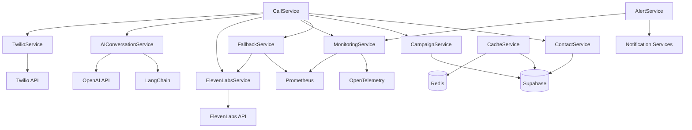

# Visión General de Servicios Backend

## Introducción

El backend del sistema de automatización de llamadas está diseñado siguiendo una arquitectura orientada a servicios. Cada servicio es responsable de una funcionalidad específica y se comunica con otros servicios a través de interfaces bien definidas. Esta arquitectura permite una mayor modularidad, facilita el mantenimiento y mejora la escalabilidad del sistema.

## Estructura de Servicios

El sistema está compuesto por los siguientes servicios principales:

### 1. CallService

**Propósito**: Gestionar el ciclo de vida completo de las llamadas telefónicas.

**Responsabilidades**:
- Iniciar llamadas salientes
- Procesar respuestas de llamadas
- Gestionar estados de llamadas
- Coordinar la interacción entre Twilio, ElevenLabs y el servicio de IA

**Dependencias**:
- TwilioService
- AIConversationService
- ElevenLabsService
- MonitoringService
- FallbackService
- CampaignService
- ContactService

### 2. CampaignService

**Propósito**: Gestionar campañas de llamadas automatizadas.

**Responsabilidades**:
- Crear, actualizar y eliminar campañas
- Programar campañas
- Gestionar estadísticas de campañas
- Asignar contactos a campañas

**Dependencias**:
- Supabase (para persistencia)

### 3. ContactService

**Propósito**: Gestionar contactos y listas de contactos.

**Responsabilidades**:
- Crear, actualizar y eliminar contactos
- Gestionar listas de contactos
- Asignar contactos a listas
- Validar información de contactos

**Dependencias**:
- Supabase (para persistencia)

### 4. AIConversationService

**Propósito**: Procesar conversaciones utilizando inteligencia artificial.

**Responsabilidades**:
- Generar respuestas basadas en IA
- Mantener el contexto de la conversación
- Analizar sentimientos en tiempo real
- Sugerir acciones basadas en la conversación

**Dependencias**:
- OpenAI API
- LangChain

### 5. ElevenLabsService

**Propósito**: Integrar con la API de ElevenLabs para síntesis de voz.

**Responsabilidades**:
- Generar audio a partir de texto
- Iniciar llamadas salientes a través de ElevenLabs
- Gestionar conversaciones de voz
- Manejar errores de la API de ElevenLabs

**Dependencias**:
- ElevenLabs API
- Gestor de secretos

### 6. TwilioService

**Propósito**: Integrar con la API de Twilio para telefonía.

**Responsabilidades**:
- Iniciar llamadas telefónicas
- Procesar webhooks de Twilio
- Gestionar estados de llamadas
- Manejar grabaciones de llamadas

**Dependencias**:
- Twilio API

### 7. CacheService

**Propósito**: Gestionar el sistema de caché para mejorar el rendimiento.

**Responsabilidades**:
- Almacenar y recuperar datos en caché
- Sincronizar caché con Supabase
- Gestionar TTL (Time-To-Live) de elementos en caché
- Optimizar el uso de caché según patrones de acceso

**Dependencias**:
- Redis
- Supabase (para sincronización)

### 8. MonitoringService

**Propósito**: Proporcionar monitoreo y métricas del sistema.

**Responsabilidades**:
- Registrar métricas de llamadas
- Crear trazas distribuidas
- Monitorear latencia y calidad de audio
- Exponer métricas para Prometheus

**Dependencias**:
- Prometheus
- OpenTelemetry

### 9. FallbackService

**Propósito**: Proporcionar mecanismos de respaldo en caso de fallos.

**Responsabilidades**:
- Implementar circuit breaker para servicios externos
- Proporcionar respuestas predeterminadas en caso de fallos
- Gestionar reintentos con backoff exponencial
- Monitorear fallos y recuperación

**Dependencias**:
- ElevenLabs API
- Prometheus (para métricas)

### 10. AlertService

**Propósito**: Gestionar alertas y notificaciones del sistema.

**Responsabilidades**:
- Enviar alertas en caso de errores críticos
- Notificar sobre umbrales de métricas superados
- Gestionar canales de notificación (email, Slack, etc.)
- Configurar políticas de alertas

**Dependencias**:
- Servicios de notificación (email, Slack, etc.)
- MonitoringService

## Diagrama de Interacción de Servicios



## Principios de Diseño

Los servicios del backend siguen estos principios de diseño:

1. **Responsabilidad única**: Cada servicio tiene una responsabilidad bien definida.
2. **Desacoplamiento**: Los servicios están desacoplados y se comunican a través de interfaces.
3. **Inyección de dependencias**: Las dependencias se inyectan en los servicios, facilitando las pruebas.
4. **Manejo de errores**: Cada servicio implementa estrategias robustas de manejo de errores.
5. **Observabilidad**: Los servicios exponen métricas y logs para monitoreo.
6. **Configurabilidad**: Los servicios son configurables a través de variables de entorno.
7. **Idempotencia**: Las operaciones críticas son idempotentes para garantizar consistencia.

## Configuración de Servicios

La configuración de los servicios se realiza principalmente a través de variables de entorno y archivos de configuración. El módulo `app/config/settings.py` centraliza la configuración del sistema.

Ejemplo de configuración:

```python
class Settings(BaseSettings):
    # Database Configuration
    DATABASE_URL: str

    # Supabase Configuration
    SUPABASE_URL: str
    SUPABASE_KEY: str

    # Twilio Configuration
    TWILIO_ACCOUNT_SID: str
    TWILIO_AUTH_TOKEN: str
    TWILIO_PHONE_NUMBER: str

    # ElevenLabs Configuration
    ELEVENLABS_API_KEY: str
    ELEVENLABS_DEFAULT_VOICE: str

    # Cache Configuration
    REDIS_URL: str
    REDIS_PASSWORD: str
    REDIS_CACHE_TTL: int

    # OpenAI Configuration
    OPENAI_API_KEY: str
    DEFAULT_MODEL: str

    # Application Configuration
    APP_NAME: str
    APP_ENV: str
    DEBUG: bool
```

## Inicialización de Servicios

Los servicios se inicializan en el módulo `app/main.py` durante el arranque de la aplicación:

```python
# Inicializar servicios
campaign_service = CampaignService(supabase_client)
contact_service = ContactService(supabase_client)
call_service = CallService(supabase_client)
cache_service = CacheService()

# Iniciar tareas en segundo plano
@app.on_event("startup")
async def startup_event():
    # Iniciar sincronización de caché
    await cache_service.start_sync()

    # Iniciar monitoreo
    monitoring_service = MonitoringService()
    await monitoring_service.start()
```

## Extensibilidad

El sistema está diseñado para ser extensible:

1. **Nuevos servicios**: Se pueden añadir nuevos servicios siguiendo el patrón establecido.
2. **Nuevas integraciones**: Se pueden integrar nuevos proveedores de telefonía o síntesis de voz.
3. **Nuevos modelos de IA**: Se pueden incorporar nuevos modelos de IA para mejorar las conversaciones.
4. **Nuevos canales**: Se puede extender para soportar canales adicionales como SMS o WhatsApp.

## Consideraciones de Rendimiento

Para garantizar un alto rendimiento, los servicios implementan:

1. **Caché**: Uso extensivo de caché para reducir llamadas a servicios externos.
2. **Procesamiento asíncrono**: Uso de async/await para operaciones de I/O.
3. **Pooling de conexiones**: Reutilización de conexiones para servicios externos.
4. **Backoff exponencial**: Reintentos con backoff exponencial para servicios externos.
5. **Circuit breaker**: Protección contra fallos en cascada.

## Consideraciones de Seguridad

Los servicios implementan medidas de seguridad como:

1. **Gestión segura de secretos**: Las credenciales se gestionan de forma segura.
2. **Validación de entrada**: Todos los datos de entrada se validan.
3. **Limitación de tasa**: Se implementa rate limiting para prevenir abusos.
4. **Auditoría**: Se registran acciones críticas para auditoría.
5. **Principio de privilegio mínimo**: Cada servicio tiene solo los permisos necesarios.
