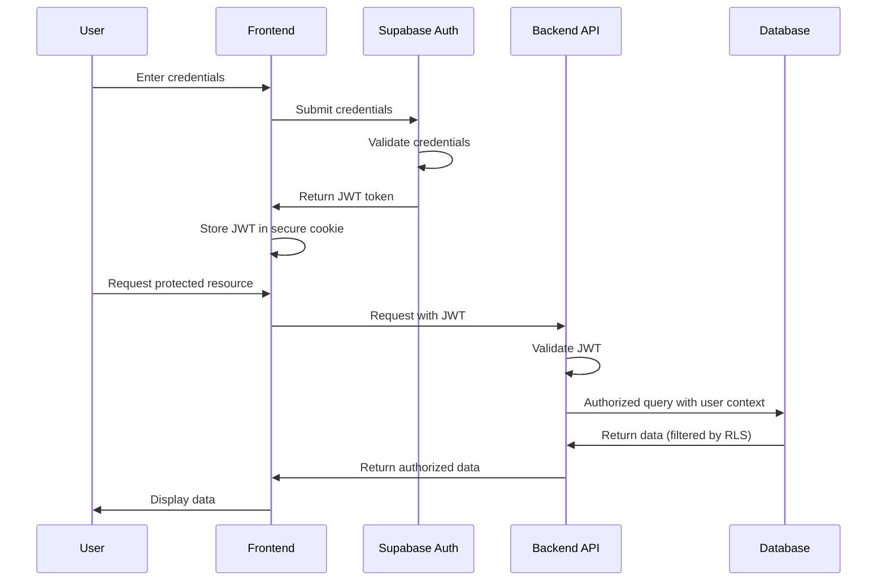
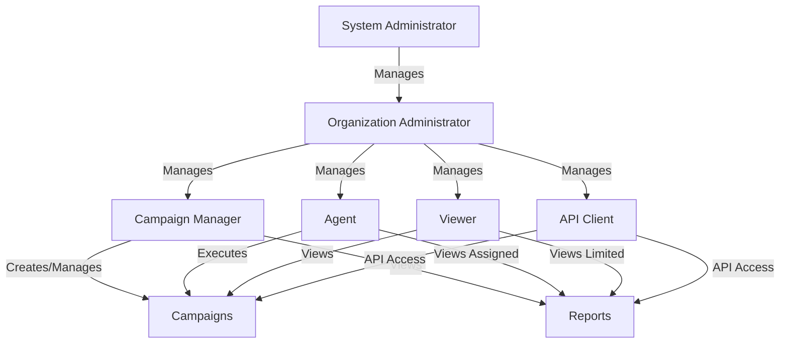

# Access Control Implementation - Technical Documentation

## Overview

This document provides detailed technical information about the access control mechanisms implemented in the Call Automation System. It covers authentication, authorization, Role-Based Access Control (RBAC), and implementation details for securing access to sensitive data and functionality.

## Authentication System

### Authentication Flow

The system uses Supabase Authentication with the following flow:

1. User submits credentials (email/password or SSO)
2. Supabase validates credentials and issues a JWT token
3. JWT token is stored in secure, HttpOnly cookies
4. Subsequent requests include the JWT for authentication
5. Backend validates JWT signature and expiration



### Multi-Factor Authentication (MFA)

MFA is implemented using:

- Time-based One-Time Passwords (TOTP)
- SMS verification codes (via Twilio)
- Email verification codes

```typescript
// Example of MFA setup in frontend
async function setupMFA(userId: string, mfaType: 'totp' | 'sms' | 'email') {
  try {
    // Request MFA setup from backend
    const response = await api.post('/auth/mfa/setup', {
      userId,
      mfaType
    });
    
    if (mfaType === 'totp') {
      // Show QR code for TOTP setup
      const { qrCodeUrl, secret } = response.data;
      setQrCodeUrl(qrCodeUrl);
      setSecret(secret);
    } else if (mfaType === 'sms') {
      // Send verification code to user's phone
      const { phoneNumber, messageStatus } = response.data;
      setVerificationSent(true);
      setPhoneNumber(phoneNumber);
    } else if (mfaType === 'email') {
      // Send verification code to user's email
      const { email, messageStatus } = response.data;
      setVerificationSent(true);
      setEmail(email);
    }
  } catch (error) {
    console.error('Failed to setup MFA:', error);
    setError('Failed to setup MFA. Please try again.');
  }
}
```

```python
# Backend implementation of MFA setup
@router.post("/auth/mfa/setup")
async def setup_mfa(
    request: MFASetupRequest,
    current_user: User = Depends(get_current_user),
    auth_service: AuthService = Depends(get_auth_service)
):
    # Verify user has permission to setup MFA
    if current_user.id != request.user_id and not current_user.is_admin:
        raise HTTPException(status_code=403, detail="Not authorized")
    
    if request.mfa_type == "totp":
        # Generate TOTP secret and QR code
        secret, qr_code_url = auth_service.generate_totp_secret(request.user_id)
        return {"qrCodeUrl": qr_code_url, "secret": secret}
    
    elif request.mfa_type == "sms":
        # Send SMS verification code
        phone_number = await auth_service.get_user_phone(request.user_id)
        message_status = await auth_service.send_sms_verification(phone_number)
        return {"phoneNumber": mask_phone_number(phone_number), "messageStatus": message_status}
    
    elif request.mfa_type == "email":
        # Send email verification code
        email = await auth_service.get_user_email(request.user_id)
        message_status = await auth_service.send_email_verification(email)
        return {"email": mask_email(email), "messageStatus": message_status}
    
    else:
        raise HTTPException(status_code=400, detail="Invalid MFA type")
```

## Role-Based Access Control (RBAC)

### Role Hierarchy

The system implements the following role hierarchy:

1. **System Administrator**: Full access to all system functions and data
2. **Organization Administrator**: Full access to organization's data and functions
3. **Campaign Manager**: Can create and manage campaigns and view reports
4. **Agent**: Can view assigned campaigns and make/receive calls
5. **Viewer**: Read-only access to specific campaigns and reports
6. **API Client**: Limited access for external integrations



### Permission Matrix

| Resource | System Admin | Org Admin | Campaign Manager | Agent | Viewer | API Client |
|----------|--------------|-----------|------------------|-------|--------|------------|
| Users | CRUD | CRUD (org) | - | - | - | - |
| Organizations | CRUD | R | - | - | - | - |
| Campaigns | CRUD | CRUD | CRUD | R | R | R |
| Contacts | CRUD | CRUD | CRUD | R | R | R |
| Calls | CRUD | CRUD | CRUD | CRU | R | R |
| Call Recordings | CRUD | CRUD | R | R | - | - |
| Reports | CRUD | CRUD | R | R (limited) | R (limited) | R (limited) |
| System Settings | CRUD | - | - | - | - | - |
| Audit Logs | CRUD | R (org) | - | - | - | - |

### Implementation in Database

Role-based access control is implemented at the database level using Supabase Row Level Security (RLS):

```sql
-- Example of RLS policies for campaigns table
-- Allow system admins full access
CREATE POLICY "System admins have full access to campaigns"
ON campaigns
USING (
  EXISTS (
    SELECT 1 FROM users
    WHERE users.id = auth.uid()
    AND users.role = 'system_admin'
  )
);

-- Allow org admins access to their organization's campaigns
CREATE POLICY "Org admins have access to their organization's campaigns"
ON campaigns
USING (
  EXISTS (
    SELECT 1 FROM users
    WHERE users.id = auth.uid()
    AND users.role = 'org_admin'
    AND users.organization_id = campaigns.organization_id
  )
);

-- Allow campaign managers to access campaigns they manage
CREATE POLICY "Campaign managers can access campaigns they manage"
ON campaigns
USING (
  EXISTS (
    SELECT 1 FROM campaign_managers
    WHERE campaign_managers.user_id = auth.uid()
    AND campaign_managers.campaign_id = campaigns.id
  )
);

-- Allow agents to access campaigns they're assigned to
CREATE POLICY "Agents can access campaigns they're assigned to"
ON campaigns
USING (
  EXISTS (
    SELECT 1 FROM campaign_agents
    WHERE campaign_agents.user_id = auth.uid()
    AND campaign_agents.campaign_id = campaigns.id
  )
);

-- Allow viewers to read campaigns they have access to
CREATE POLICY "Viewers can read campaigns they have access to"
ON campaigns
FOR SELECT
USING (
  EXISTS (
    SELECT 1 FROM campaign_viewers
    WHERE campaign_viewers.user_id = auth.uid()
    AND campaign_viewers.campaign_id = campaigns.id
  )
);
```

### Implementation in Backend

The backend enforces RBAC through middleware and dependency injection:

```python
# Role-based access control middleware
def require_roles(allowed_roles: List[str]):
    def dependency(
        current_user: User = Depends(get_current_user)
    ):
        if current_user.role not in allowed_roles:
            raise HTTPException(
                status_code=403,
                detail=f"User with role '{current_user.role}' is not authorized to access this resource"
            )
        return current_user
    return dependency

# Example usage in router
@router.post("/campaigns/")
async def create_campaign(
    campaign: CampaignCreate,
    current_user: User = Depends(require_roles(["system_admin", "org_admin", "campaign_manager"])),
    campaign_service: CampaignService = Depends(get_campaign_service)
):
    # User is authorized, proceed with campaign creation
    return await campaign_service.create_campaign(campaign, current_user)
```

### Implementation in Frontend

The frontend implements RBAC by conditionally rendering UI elements and restricting navigation:

```typescript
// Role-based UI rendering
function CampaignActions({ campaign }) {
  const { user } = useAuth();
  
  // Check if user has edit permission
  const canEdit = useMemo(() => {
    return ['system_admin', 'org_admin', 'campaign_manager'].includes(user.role) ||
      (campaign.managers || []).includes(user.id);
  }, [user, campaign]);
  
  // Check if user has delete permission
  const canDelete = useMemo(() => {
    return ['system_admin', 'org_admin'].includes(user.role);
  }, [user]);
  
  return (
    <div className="campaign-actions">
      {canEdit && (
        <Button variant="outline" onClick={() => navigate(`/campaigns/${campaign.id}/edit`)}>
          Edit
        </Button>
      )}
      
      {canDelete && (
        <Button variant="destructive" onClick={() => handleDeleteCampaign(campaign.id)}>
          Delete
        </Button>
      )}
      
      {/* All users with access can view */}
      <Button variant="default" onClick={() => navigate(`/campaigns/${campaign.id}`)}>
        View
      </Button>
    </div>
  );
}
```

## Access Control for Sensitive Data

### Data Classification and Access Levels

The system classifies data into sensitivity levels with corresponding access controls:

| Data Classification | Description | Access Control Mechanism |
|---------------------|-------------|--------------------------|
| Public | Non-sensitive data | Basic authentication |
| Internal | Business data with limited sensitivity | Role-based access |
| Confidential | Sensitive business data | Role-based + purpose limitation |
| Restricted | Highly sensitive personal data | Role-based + explicit authorization + logging |

### Implementation for Call Recordings

Call recordings are classified as Restricted data with the following access controls:

```python
# Access control for call recordings
@router.get("/calls/{call_id}/recording")
async def get_call_recording(
    call_id: UUID,
    current_user: User = Depends(get_current_user),
    call_service: CallService = Depends(get_call_service),
    audit_service: AuditService = Depends(get_audit_service)
):
    # Check if user has permission to access this recording
    call = await call_service.get_call(call_id)
    
    # Get campaign to check permissions
    campaign = await call_service.get_campaign(call.campaign_id)
    
    # Check if user has access to this campaign
    if not await call_service.user_has_campaign_access(current_user.id, campaign.id):
        raise HTTPException(status_code=403, detail="Not authorized to access this recording")
    
    # Check if user has permission to access recordings
    if current_user.role not in ["system_admin", "org_admin"] and not campaign.managers.includes(current_user.id):
        raise HTTPException(status_code=403, detail="Not authorized to access recordings")
    
    # Log access to restricted data
    await audit_service.log_data_access(
        user_id=current_user.id,
        resource_type="call_recording",
        resource_id=call_id,
        action="read",
        reason="User requested call recording"
    )
    
    # Get the recording with decryption
    recording = await call_service.get_call_recording(call_id)
    
    return recording
```

## API Security

### API Authentication

The API uses the following authentication methods:

1. **JWT Authentication**: For user-based access
2. **API Key Authentication**: For service-to-service communication
3. **OAuth 2.0**: For third-party integrations

```python
# API key authentication middleware
async def api_key_auth(request: Request, api_key_service: ApiKeyService = Depends(get_api_key_service)):
    api_key = request.headers.get("X-API-Key")
    if not api_key:
        raise HTTPException(status_code=401, detail="API key is required")
    
    # Validate API key
    client = await api_key_service.validate_api_key(api_key)
    if not client:
        raise HTTPException(status_code=401, detail="Invalid API key")
    
    # Set client in request state
    request.state.client = client
    
    return client
```

### Rate Limiting

Rate limiting is implemented to prevent abuse:

```python
# Rate limiting middleware
class RateLimiter:
    def __init__(self, redis_client, limit: int, window: int):
        self.redis = redis_client
        self.limit = limit  # Number of requests
        self.window = window  # Time window in seconds
    
    async def __call__(self, request: Request):
        # Get client identifier (IP or user ID)
        client_id = self._get_client_identifier(request)
        
        # Get current count
        current = await self.redis.get(f"ratelimit:{client_id}")
        current = int(current) if current else 0
        
        # Check if limit exceeded
        if current >= self.limit:
            raise HTTPException(
                status_code=429,
                detail="Too many requests. Please try again later."
            )
        
        # Increment counter
        pipe = self.redis.pipeline()
        pipe.incr(f"ratelimit:{client_id}")
        pipe.expire(f"ratelimit:{client_id}", self.window)
        await pipe.execute()
    
    def _get_client_identifier(self, request: Request):
        # Use user ID if authenticated
        if hasattr(request.state, "user") and request.state.user:
            return f"user:{request.state.user.id}"
        
        # Use API client ID if using API key
        if hasattr(request.state, "client") and request.state.client:
            return f"client:{request.state.client.id}"
        
        # Fall back to IP address
        return f"ip:{request.client.host}"
```

## Session Management

### Session Lifecycle

1. **Creation**: Session created upon successful authentication
2. **Validation**: Session validated on each request
3. **Renewal**: Session automatically renewed if still active
4. **Termination**: Session terminated on logout or expiration

```typescript
// Frontend session management
const SessionProvider = ({ children }) => {
  const [session, setSession] = useState(null);
  const [loading, setLoading] = useState(true);
  
  // Initialize session
  useEffect(() => {
    const initSession = async () => {
      try {
        // Check for existing session
        const { data, error } = await supabase.auth.getSession();
        
        if (error) throw error;
        
        if (data?.session) {
          setSession(data.session);
          
          // Setup session renewal
          const { data: { subscription } } = supabase.auth.onAuthStateChange(
            (_event, session) => {
              setSession(session);
            }
          );
          
          return () => subscription.unsubscribe();
        }
      } catch (error) {
        console.error('Error initializing session:', error);
      } finally {
        setLoading(false);
      }
    };
    
    initSession();
  }, []);
  
  // Session context value
  const value = {
    session,
    loading,
    user: session?.user ?? null,
    signIn: async (credentials) => {
      // Sign in implementation
    },
    signOut: async () => {
      await supabase.auth.signOut();
      setSession(null);
    },
    // Other auth methods...
  };
  
  return (
    <SessionContext.Provider value={value}>
      {children}
    </SessionContext.Provider>
  );
};
```

### Session Security

- Sessions are stored as HttpOnly, Secure cookies
- CSRF protection implemented via double-submit cookie pattern
- Automatic session invalidation after period of inactivity
- Concurrent session management (optional limitation of active sessions)

## Audit Logging for Access Control

### Logged Events

The following access control events are logged:

1. Authentication attempts (successful and failed)
2. Authorization decisions (access granted or denied)
3. Access to sensitive data
4. Changes to access control settings
5. Session management events

```python
# Audit logging service
class AuditService:
    def __init__(self, db_session, logger):
        self.db = db_session
        self.logger = logger
    
    async def log_authentication(self, user_id, success, ip_address, user_agent, error=None):
        log_entry = AuthenticationLog(
            user_id=user_id,
            timestamp=datetime.now(),
            success=success,
            ip_address=ip_address,
            user_agent=user_agent,
            error=error
        )
        
        self.db.add(log_entry)
        await self.db.commit()
        
        # Also log to application logs
        if success:
            self.logger.info(f"User {user_id} authenticated successfully from {ip_address}")
        else:
            self.logger.warning(f"Failed authentication attempt for user {user_id} from {ip_address}: {error}")
    
    async def log_authorization(self, user_id, resource_type, resource_id, action, success, error=None):
        log_entry = AuthorizationLog(
            user_id=user_id,
            timestamp=datetime.now(),
            resource_type=resource_type,
            resource_id=resource_id,
            action=action,
            success=success,
            error=error
        )
        
        self.db.add(log_entry)
        await self.db.commit()
        
        # Also log to application logs
        if not success:
            self.logger.warning(
                f"Authorization denied for user {user_id} to {action} {resource_type}:{resource_id}: {error}"
            )
    
    async def log_data_access(self, user_id, resource_type, resource_id, action, reason=None):
        log_entry = DataAccessLog(
            user_id=user_id,
            timestamp=datetime.now(),
            resource_type=resource_type,
            resource_id=resource_id,
            action=action,
            reason=reason
        )
        
        self.db.add(log_entry)
        await self.db.commit()
        
        # Log access to sensitive data
        self.logger.info(
            f"User {user_id} accessed {resource_type}:{resource_id} with action {action}"
        )
```

## Security Testing for Access Control

### Testing Methodologies

1. **Unit Testing**: Test individual access control functions
2. **Integration Testing**: Test access control across components
3. **Penetration Testing**: Simulate attacks against access controls
4. **Automated Security Scanning**: Regular automated security tests

```python
# Example of access control unit test
@pytest.mark.asyncio
async def test_campaign_access_control():
    # Setup test database with users and campaigns
    db = get_test_db()
    
    # Create test users with different roles
    admin_user = await create_test_user(db, role="system_admin")
    manager_user = await create_test_user(db, role="campaign_manager")
    agent_user = await create_test_user(db, role="agent")
    viewer_user = await create_test_user(db, role="viewer")
    
    # Create test campaign
    campaign = await create_test_campaign(db)
    
    # Assign manager to campaign
    await assign_campaign_manager(db, campaign.id, manager_user.id)
    
    # Assign agent to campaign
    await assign_campaign_agent(db, campaign.id, agent_user.id)
    
    # Assign viewer to campaign
    await assign_campaign_viewer(db, campaign.id, viewer_user.id)
    
    # Test admin access (should have full access)
    assert await user_can_view_campaign(db, admin_user.id, campaign.id) == True
    assert await user_can_edit_campaign(db, admin_user.id, campaign.id) == True
    assert await user_can_delete_campaign(db, admin_user.id, campaign.id) == True
    
    # Test manager access
    assert await user_can_view_campaign(db, manager_user.id, campaign.id) == True
    assert await user_can_edit_campaign(db, manager_user.id, campaign.id) == True
    assert await user_can_delete_campaign(db, manager_user.id, campaign.id) == False
    
    # Test agent access
    assert await user_can_view_campaign(db, agent_user.id, campaign.id) == True
    assert await user_can_edit_campaign(db, agent_user.id, campaign.id) == False
    assert await user_can_delete_campaign(db, agent_user.id, campaign.id) == False
    
    # Test viewer access
    assert await user_can_view_campaign(db, viewer_user.id, campaign.id) == True
    assert await user_can_edit_campaign(db, viewer_user.id, campaign.id) == False
    assert await user_can_delete_campaign(db, viewer_user.id, campaign.id) == False
    
    # Test unauthorized user
    unrelated_user = await create_test_user(db, role="viewer")
    assert await user_can_view_campaign(db, unrelated_user.id, campaign.id) == False
    assert await user_can_edit_campaign(db, unrelated_user.id, campaign.id) == False
    assert await user_can_delete_campaign(db, unrelated_user.id, campaign.id) == False
```

## References

- [OWASP Access Control Cheat Sheet](https://cheatsheetseries.owasp.org/cheatsheets/Access_Control_Cheat_Sheet.html)
- [Supabase Row Level Security](https://supabase.com/docs/guides/auth/row-level-security)
- [JWT Best Practices](https://datatracker.ietf.org/doc/html/draft-ietf-oauth-jwt-bcp-07)
- [NIST Digital Identity Guidelines](https://pages.nist.gov/800-63-3/)
