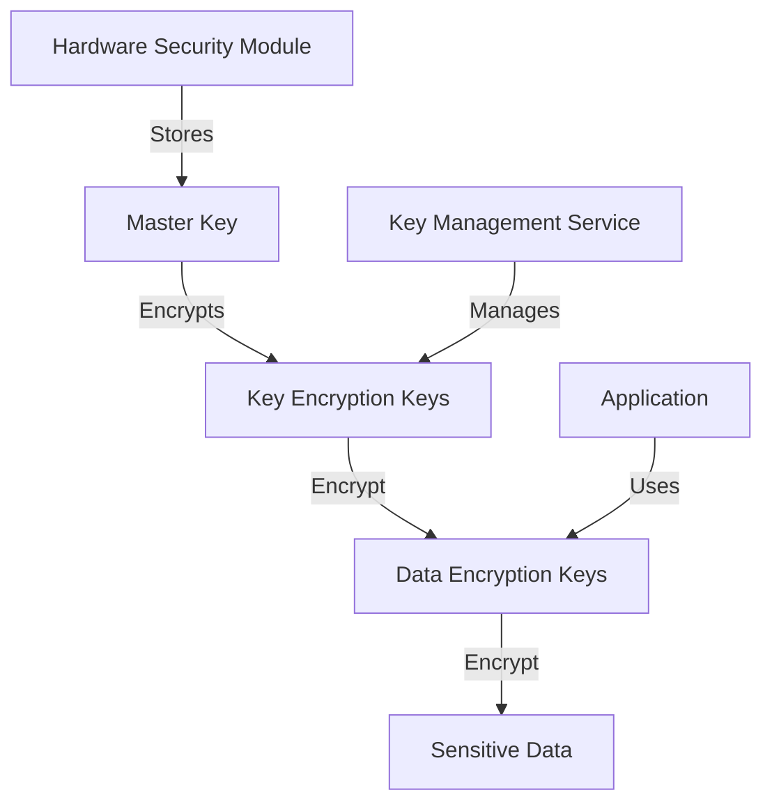

# Data Encryption Implementation - Technical Documentation

## Overview

This document provides detailed technical information about the encryption mechanisms implemented in the Call Automation System to protect sensitive data. It covers encryption in transit, encryption at rest, key management, and implementation details for different components of the system.

## Encryption Standards and Algorithms

### Transport Layer Encryption

| Protocol | Version | Cipher Suites | Implementation |
|----------|---------|---------------|----------------|
| TLS | 1.3 | TLS_AES_256_GCM_SHA384, TLS_CHACHA20_POLY1305_SHA256 | Implemented via HTTPS for all API endpoints and web interfaces |
| HTTPS | 2.0 | As per TLS 1.3 | Enforced for all web traffic with HSTS headers |

### Data-at-Rest Encryption

| Data Type | Encryption Algorithm | Key Length | Implementation |
|-----------|----------------------|------------|----------------|
| Database records | AES-256-GCM | 256 bits | Column-level encryption via Supabase pgcrypto |
| Call recordings | AES-256-CBC | 256 bits | File-level encryption before storage |
| Configuration files | AES-256-GCM | 256 bits | Encrypted using environment-specific keys |
| Backups | AES-256-GCM | 256 bits | Encrypted before storage with separate backup keys |

## Key Management System

### Key Hierarchy

The system implements a hierarchical key management system:

1. **Master Key**: Hardware-secured key used only for encrypting/decrypting Data Encryption Keys
2. **Data Encryption Keys (DEKs)**: Used for actual data encryption/decryption
3. **Key Encryption Keys (KEKs)**: Used to encrypt DEKs for storage



### Key Rotation Policies

| Key Type | Rotation Frequency | Procedure | Responsible Role |
|----------|-------------------|-----------|------------------|
| Master Key | Yearly | Manual rotation with dual control | Security Administrator |
| KEKs | Quarterly | Automated with manual approval | Security Administrator |
| DEKs | Monthly | Fully automated | System |

### Implementation Details

```python
# Example implementation of encryption service
from cryptography.fernet import Fernet
from cryptography.hazmat.primitives.kdf.pbkdf2 import PBKDF2HMAC
from cryptography.hazmat.primitives import hashes
import base64
import os

class EncryptionService:
    def __init__(self, key_management_service):
        self.kms = key_management_service
        
    def encrypt_sensitive_data(self, data, data_type):
        # Get the appropriate DEK for the data type
        dek = self.kms.get_current_dek(data_type)
        
        # Create a Fernet cipher with the DEK
        cipher = Fernet(dek)
        
        # Encrypt the data
        encrypted_data = cipher.encrypt(data.encode())
        
        return {
            "encrypted_data": encrypted_data,
            "key_id": self.kms.get_current_dek_id(data_type),
            "encryption_date": datetime.now().isoformat()
        }
    
    def decrypt_sensitive_data(self, encrypted_data_obj):
        # Get the DEK used for encryption
        dek = self.kms.get_dek_by_id(encrypted_data_obj["key_id"])
        
        # Create a Fernet cipher with the DEK
        cipher = Fernet(dek)
        
        # Decrypt the data
        decrypted_data = cipher.decrypt(encrypted_data_obj["encrypted_data"]).decode()
        
        return decrypted_data
```

## Database Encryption

### Column-Level Encryption

Sensitive columns in the database are encrypted using pgcrypto extension in Supabase:

```sql
-- Example of creating a table with encrypted columns
CREATE TABLE contacts (
    id UUID PRIMARY KEY DEFAULT uuid_generate_v4(),
    name TEXT NOT NULL,
    -- Encrypted phone number column
    phone_number_encrypted BYTEA NOT NULL,
    -- Additional metadata for decryption
    phone_number_key_id UUID NOT NULL REFERENCES encryption_keys(id),
    -- Other non-sensitive fields
    created_at TIMESTAMP WITH TIME ZONE DEFAULT NOW(),
    updated_at TIMESTAMP WITH TIME ZONE DEFAULT NOW()
);

-- Function to encrypt phone numbers
CREATE OR REPLACE FUNCTION encrypt_phone_number(phone TEXT, key_id UUID)
RETURNS TABLE(encrypted_data BYTEA, used_key_id UUID) AS $$
DECLARE
    encryption_key TEXT;
BEGIN
    -- Get the encryption key from the keys table
    SELECT key_value INTO encryption_key FROM encryption_keys WHERE id = key_id;
    
    -- Return encrypted data and key ID
    RETURN QUERY SELECT 
        pgp_sym_encrypt(phone, encryption_key)::BYTEA,
        key_id;
END;
$$ LANGUAGE plpgsql SECURITY DEFINER;

-- Function to decrypt phone numbers
CREATE OR REPLACE FUNCTION decrypt_phone_number(encrypted_data BYTEA, key_id UUID)
RETURNS TEXT AS $$
DECLARE
    encryption_key TEXT;
    decrypted_phone TEXT;
BEGIN
    -- Get the encryption key from the keys table
    SELECT key_value INTO encryption_key FROM encryption_keys WHERE id = key_id;
    
    -- Decrypt the phone number
    decrypted_phone := pgp_sym_decrypt(encrypted_data, encryption_key);
    
    RETURN decrypted_phone;
END;
$$ LANGUAGE plpgsql SECURITY DEFINER;
```

### Application-Level Encryption

For additional security, sensitive data is also encrypted at the application level before being stored in the database:

```python
# Example of application-level encryption in the contacts service
class ContactService:
    def __init__(self, db_session, encryption_service):
        self.db = db_session
        self.encryption_service = encryption_service
    
    async def create_contact(self, contact_data):
        # Encrypt sensitive data
        encrypted_phone = self.encryption_service.encrypt_sensitive_data(
            contact_data.phone_number, 
            "phone_number"
        )
        
        # Create new contact with encrypted data
        new_contact = Contact(
            name=contact_data.name,
            phone_number_encrypted=encrypted_phone["encrypted_data"],
            phone_number_key_id=encrypted_phone["key_id"],
            # Other fields...
        )
        
        self.db.add(new_contact)
        await self.db.commit()
        await self.db.refresh(new_contact)
        
        return new_contact
    
    async def get_contact(self, contact_id):
        contact = await self.db.get(Contact, contact_id)
        
        # Decrypt sensitive data
        contact_dict = contact.__dict__
        contact_dict["phone_number"] = self.encryption_service.decrypt_sensitive_data({
            "encrypted_data": contact.phone_number_encrypted,
            "key_id": contact.phone_number_key_id
        })
        
        return contact_dict
```

## Call Recording Encryption

### Recording Storage Process

1. Call recordings are initially stored temporarily in Twilio's secure storage
2. The system retrieves recordings via secure TLS connection
3. Recordings are encrypted using AES-256-CBC before being stored in the system's storage
4. Encryption keys are managed separately from the storage system

```python
# Example of call recording encryption
class CallRecordingService:
    def __init__(self, twilio_client, encryption_service, storage_service):
        self.twilio_client = twilio_client
        self.encryption_service = encryption_service
        self.storage_service = storage_service
    
    async def process_new_recording(self, recording_sid):
        # Retrieve recording from Twilio
        recording_url = self.twilio_client.get_recording_url(recording_sid)
        recording_binary = await self.twilio_client.download_recording(recording_url)
        
        # Encrypt the recording
        encrypted_recording = self.encryption_service.encrypt_sensitive_data(
            recording_binary,
            "call_recording"
        )
        
        # Store encrypted recording
        storage_path = f"recordings/{recording_sid}"
        await self.storage_service.store_file(
            storage_path,
            encrypted_recording["encrypted_data"]
        )
        
        # Store metadata for later decryption
        metadata = {
            "key_id": encrypted_recording["key_id"],
            "encryption_date": encrypted_recording["encryption_date"],
            "original_recording_sid": recording_sid
        }
        
        await self.storage_service.store_metadata(storage_path, metadata)
        
        return {
            "storage_path": storage_path,
            "metadata": metadata
        }
```

## Encryption for Third-Party Integrations

### Twilio Integration

- All API calls to Twilio use TLS 1.3
- Twilio authentication credentials are stored encrypted
- Webhook endpoints are secured with signature validation

### ElevenLabs Integration

- API keys are stored encrypted in the configuration
- Voice data is transmitted over TLS 1.3
- Generated audio files are encrypted before storage

## Key Rotation Implementation

```python
# Example of key rotation implementation
class KeyRotationService:
    def __init__(self, kms, db_session):
        self.kms = kms
        self.db = db_session
    
    async def rotate_data_encryption_keys(self):
        # Get all active DEKs
        active_deks = await self.kms.get_all_active_deks()
        
        for dek_info in active_deks:
            # Generate new DEK
            new_dek_id = await self.kms.generate_new_dek(dek_info["data_type"])
            
            # Re-encrypt data with new DEK
            await self.reencrypt_data(dek_info["id"], new_dek_id, dek_info["data_type"])
            
            # Deactivate old DEK (but keep it for historical data)
            await self.kms.deactivate_dek(dek_info["id"])
    
    async def reencrypt_data(self, old_key_id, new_key_id, data_type):
        # Implementation depends on data type
        if data_type == "phone_number":
            await self.reencrypt_phone_numbers(old_key_id, new_key_id)
        elif data_type == "call_recording":
            await self.reencrypt_call_recordings(old_key_id, new_key_id)
        # Other data types...
```

## Security Monitoring for Encryption

The system implements continuous monitoring for encryption-related security events:

1. Failed decryption attempts are logged and trigger alerts
2. Key usage is monitored for anomalies
3. Encryption performance is monitored to detect potential issues

```python
# Example of encryption monitoring
class EncryptionMonitor:
    def __init__(self, logging_service, alert_service):
        self.logging_service = logging_service
        self.alert_service = alert_service
    
    async def log_encryption_operation(self, operation_type, data_type, success, error=None):
        log_entry = {
            "timestamp": datetime.now().isoformat(),
            "operation": operation_type,  # "encrypt" or "decrypt"
            "data_type": data_type,
            "success": success,
            "error": str(error) if error else None
        }
        
        await self.logging_service.log("encryption_operations", log_entry)
        
        # Alert on failures
        if not success:
            await self.alert_service.send_alert(
                "encryption_failure",
                f"Failed to {operation_type} {data_type}: {error}"
            )
```

## Compliance Validation

The encryption implementation is regularly validated for compliance with:

- GDPR requirements for technical measures
- CCPA security requirements
- Industry best practices (NIST recommendations)
- PCI DSS requirements (if applicable)

## References

- [NIST Encryption Guidelines](https://csrc.nist.gov/publications/detail/sp/800-175b/rev-1/final)
- [Supabase pgcrypto Documentation](https://supabase.com/docs/guides/database/extensions/pgcrypto)
- [Python cryptography library](https://cryptography.io/en/latest/)
- [OWASP Cryptographic Storage Cheat Sheet](https://cheatsheetseries.owasp.org/cheatsheets/Cryptographic_Storage_Cheat_Sheet.html)
