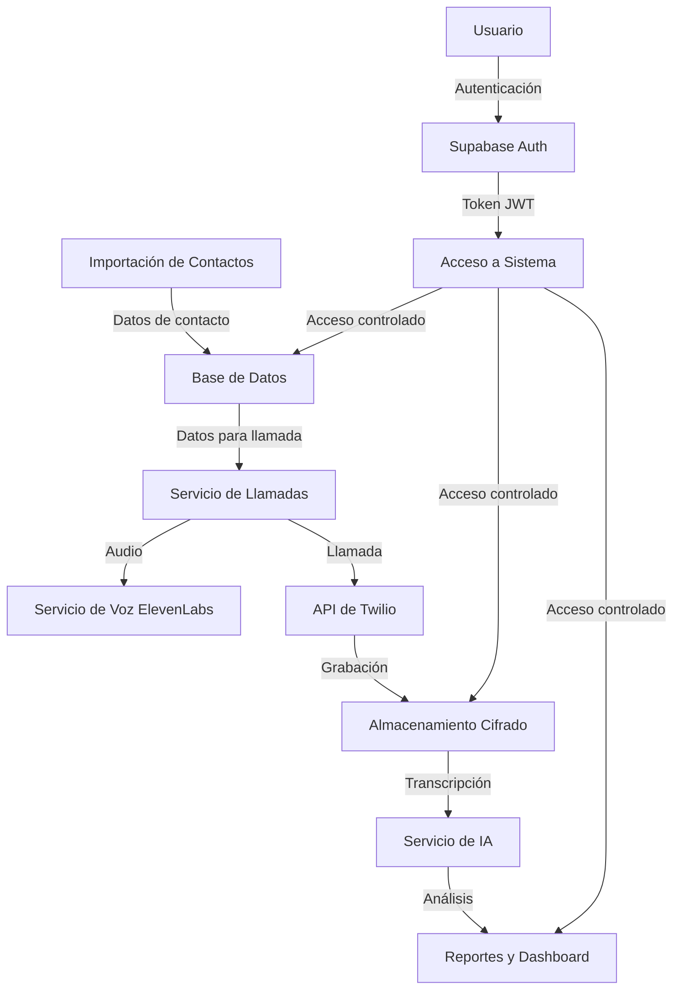

# Protección de Datos - Sistema de Automatización de Llamadas

## Introducción

Este documento describe las políticas, procedimientos y medidas técnicas implementadas para garantizar la protección de datos personales en el Sistema de Automatización de Llamadas. Dado que el sistema procesa información personal sensible como nombres, números de teléfono y grabaciones de voz, la protección de estos datos es una prioridad fundamental.

## Principios de Protección de Datos

El sistema se ha diseñado siguiendo estos principios fundamentales:

1. **Minimización de datos**: Solo recopilamos y procesamos los datos estrictamente necesarios para el funcionamiento del servicio.
2. **Limitación de propósito**: Los datos se utilizan únicamente para los fines específicos para los que fueron recopilados.
3. **Transparencia**: Proporcionamos información clara sobre qué datos se recopilan y cómo se utilizan.
4. **Seguridad por diseño**: La protección de datos está integrada en la arquitectura del sistema desde su concepción.
5. **Control del usuario**: Los usuarios tienen control sobre sus datos personales y pueden ejercer sus derechos.
6. **Rendición de cuentas**: Mantenemos registros de todas las actividades de procesamiento de datos.

## Datos Personales Procesados

### Categorías de Datos

| Categoría | Ejemplos | Sensibilidad | Medidas de Protección |
|-----------|----------|--------------|------------------------|
| Datos de identificación | Nombres, correos electrónicos | Media | Cifrado en reposo, control de acceso |
| Datos de contacto | Números de teléfono | Alta | Cifrado en reposo, enmascaramiento parcial en UI |
| Contenido de comunicaciones | Grabaciones de llamadas, transcripciones | Muy alta | Cifrado, acceso restringido, retención limitada |
| Metadatos | Duración de llamadas, timestamps | Baja | Control de acceso basado en roles |
| Datos de usuario del sistema | Credenciales, roles | Alta | Hashing de contraseñas, autenticación MFA |

### Flujo de Datos



## Medidas Técnicas de Protección

### Cifrado de Datos

- **Cifrado en tránsito**: Todas las comunicaciones utilizan TLS 1.3
- **Cifrado en reposo**: Los datos sensibles se almacenan cifrados en la base de datos
- **Cifrado de grabaciones**: Las grabaciones de llamadas se cifran con AES-256

### Control de Acceso

- **Autenticación multifactor**: Obligatoria para todos los usuarios con acceso a datos sensibles
- **Control de acceso basado en roles (RBAC)**: Implementado a través de Supabase
- **Principio de privilegio mínimo**: Los usuarios solo tienen acceso a los datos necesarios para su función

### Políticas de Seguridad en Base de Datos

```sql
-- Política para restringir acceso a datos de contactos
CREATE POLICY "Restrict access to contact data"
ON contacts FOR SELECT
USING (
    EXISTS (
        SELECT 1 FROM users
        WHERE users.id = auth.uid()
        AND (users.role = 'admin' OR users.role = 'operator')
    )
);

-- Política para enmascarar datos sensibles para usuarios con rol 'viewer'
CREATE POLICY "Mask sensitive data for viewers"
ON contacts FOR SELECT
USING (
    EXISTS (
        SELECT 1 FROM users
        WHERE users.id = auth.uid()
        AND users.role = 'viewer'
    )
)
WITH CHECK (
    phone_number = SUBSTRING(phone_number, 1, 3) || '****' || SUBSTRING(phone_number, LENGTH(phone_number)-3, 4)
);
```

### Enmascaramiento de Datos

- **UI**: Los números de teléfono se muestran parcialmente enmascarados en la interfaz
- **Logs**: La información personal se redacta automáticamente en los logs del sistema
- **Exportaciones**: Las exportaciones de datos pueden configurarse para enmascarar información sensible

## Cumplimiento Normativo

### GDPR (Reglamento General de Protección de Datos)

El sistema está diseñado para cumplir con los requisitos del GDPR:

- **Base legal para el procesamiento**: Documentamos la base legal para cada tipo de procesamiento
- **Derechos de los interesados**: Implementamos mecanismos para ejercer derechos (acceso, rectificación, supresión, etc.)
- **Evaluación de impacto**: Realizamos evaluaciones de impacto para operaciones de alto riesgo
- **Registro de actividades**: Mantenemos un registro de todas las actividades de procesamiento
- **Notificación de brechas**: Procedimientos para notificar brechas de seguridad en 72 horas

### CCPA (Ley de Privacidad del Consumidor de California)

Para cumplir con CCPA:

- **Divulgación de información**: Informamos sobre los datos recopilados y su uso
- **Derecho a eliminar**: Permitimos a los consumidores solicitar la eliminación de sus datos
- **Derecho a no vender**: No vendemos datos personales y permitimos optar por no compartir
- **Verificación de identidad**: Verificamos la identidad antes de responder a solicitudes

### Otras Regulaciones

- **Regulaciones de telecomunicaciones**: Cumplimos con las regulaciones locales sobre grabación de llamadas
- **PCI DSS**: Si se procesan datos de pago, seguimos los estándares PCI DSS
- **HIPAA**: Si se manejan datos de salud, implementamos controles adicionales

## Políticas de Retención de Datos

| Tipo de Dato | Período de Retención | Justificación | Método de Eliminación |
|--------------|----------------------|---------------|------------------------|
| Datos de contacto | Duración de la campaña + 6 meses | Necesario para análisis post-campaña | Eliminación segura de la base de datos |
| Grabaciones de llamadas | 30 días por defecto (configurable) | Necesario para análisis de calidad | Eliminación criptográfica |
| Transcripciones | 90 días | Necesario para análisis y mejora | Eliminación segura |
| Logs del sistema | 12 meses | Auditoría de seguridad | Rotación automática y eliminación |
| Datos de usuario | Hasta solicitud de eliminación | Necesario para acceso al sistema | Anonimización y eliminación |

### Configuración de Retención

La retención de datos puede configurarse a nivel de campaña:

```typescript
// Ejemplo de configuración de retención para una campaña
interface RetentionSettings {
  callRecordings: number; // días de retención
  transcripts: number; // días de retención
  contactData: number; // días de retención después de finalizar la campaña
  deleteAutomatically: boolean; // eliminar automáticamente al vencer el período
}

// Implementación en el modelo de campaña
class Campaign {
  // ... otros campos
  retentionSettings: RetentionSettings;
}
```

## Derechos de los Interesados

El sistema implementa mecanismos para que los interesados puedan ejercer sus derechos:

### Derecho de Acceso

- API endpoint para solicitar todos los datos personales almacenados
- Verificación de identidad antes de proporcionar los datos
- Formato estructurado y legible por máquina

### Derecho de Rectificación

- Interfaz para actualizar datos personales incorrectos
- Registro de cambios para fines de auditoría

### Derecho de Supresión

- Proceso para eliminar datos personales bajo solicitud
- Eliminación en cascada de datos relacionados
- Retención de datos mínimos necesarios por obligaciones legales

### Derecho de Oposición

- Mecanismo para oponerse al procesamiento de datos
- Lista de exclusión para evitar contacto futuro

## Procedimientos de Gestión de Brechas de Datos

En caso de una brecha de seguridad que afecte a datos personales:

1. **Detección e Investigación**:
   - Sistemas de monitoreo para detectar brechas potenciales
   - Equipo de respuesta a incidentes para investigar

2. **Contención y Mitigación**:
   - Procedimientos para contener la brecha
   - Medidas para mitigar el impacto

3. **Notificación**:
   - Notificación a las autoridades dentro de las 72 horas (GDPR)
   - Notificación a los afectados cuando sea necesario

4. **Documentación y Análisis**:
   - Registro detallado del incidente
   - Análisis de causa raíz
   - Implementación de medidas correctivas

## Implementación Técnica

### Anonimización y Seudonimización

```python
# Ejemplo de función de anonimización para exportación de datos
def anonymize_contact_data(contact):
    return {
        "id": contact.id,  # Se mantiene el ID como pseudónimo
        "name": f"{contact.name[0]}***",  # Primera inicial seguida de asteriscos
        "phone_number": f"+{contact.phone_number[:3]}****{contact.phone_number[-3:]}",  # Formato: +123****789
        "email": f"{contact.email[0]}***@{contact.email.split('@')[1]}" if contact.email else None,  # Primera inicial seguida de asteriscos
        "tags": contact.tags  # Los tags no contienen información personal
    }
```

### Auditoría de Acceso a Datos

```python
# Middleware para registrar acceso a datos sensibles
@app.middleware("http")
async def log_data_access(request: Request, call_next):
    response = await call_next(request)
    
    # Verificar si la ruta accede a datos sensibles
    if any(sensitive_path in request.url.path for sensitive_path in SENSITIVE_PATHS):
        # Registrar acceso en el sistema de auditoría
        await audit_logger.log_access(
            user_id=request.state.user.id,
            resource_type=get_resource_type(request.url.path),
            resource_id=get_resource_id(request.url.path),
            action="read",
            timestamp=datetime.now()
        )
    
    return response
```

## Privacidad por Diseño

El sistema implementa el concepto de "Privacidad por Diseño" a través de:

1. **Configuración predeterminada**: La configuración más restrictiva de privacidad es la predeterminada
2. **Minimización de datos**: Solo se recopilan los datos estrictamente necesarios
3. **Limitación de uso**: Los datos solo se utilizan para los fines específicos declarados
4. **Transparencia**: Documentación clara sobre el uso de datos
5. **Seguridad de extremo a extremo**: Protección en todas las etapas del ciclo de vida de los datos
6. **Respeto por la privacidad del usuario**: Control del usuario sobre sus datos

### Ejemplo de Implementación

```typescript
// Configuración predeterminada de privacidad para nuevas campañas
const defaultPrivacySettings = {
  recordCalls: false,
  retentionPeriod: 30, // días
  maskPhoneNumbers: true,
  allowTranscription: false,
  shareDataWithThirdParties: false,
  collectAnalytics: false
};

// Función para crear nueva campaña con configuración de privacidad
function createCampaign(campaignData, privacySettings = {}) {
  // Combinar con configuración predeterminada (los valores explícitos tienen prioridad)
  const finalPrivacySettings = {
    ...defaultPrivacySettings,
    ...privacySettings
  };
  
  // Crear campaña con configuración de privacidad
  return api.campaigns.create({
    ...campaignData,
    privacySettings: finalPrivacySettings
  });
}
```

## Integración con Proveedores Externos

### Twilio

- Configuración de retención de grabaciones en Twilio
- Cifrado de grabaciones
- Acceso restringido a través de URLs firmadas

### ElevenLabs

- Configuración de privacidad para síntesis de voz
- Limitación de retención de datos de voz
- Acuerdos de procesamiento de datos

### OpenAI (para transcripción y análisis)

- Configuración para no almacenar datos de conversación
- Limitación de uso de datos para entrenamiento
- Anonimización de datos antes del procesamiento

## Formación y Concienciación

- Programa de formación obligatorio para todos los usuarios del sistema
- Documentación detallada sobre prácticas de protección de datos
- Actualizaciones regulares sobre cambios en políticas y procedimientos

## Auditoría y Cumplimiento

- Auditorías periódicas de seguridad y privacidad
- Evaluaciones de impacto de protección de datos
- Revisiones de código para identificar problemas de privacidad
- Pruebas de penetración regulares

## Contacto y Responsabilidades

- Designación de un Delegado de Protección de Datos (DPO)
- Procedimiento para contactar al DPO
- Responsabilidades del equipo de desarrollo, operaciones y seguridad

## Referencias y Recursos

- [GDPR](https://gdpr.eu/)
- [CCPA](https://oag.ca.gov/privacy/ccpa)
- [Twilio Privacy & Security](https://www.twilio.com/en-us/legal/privacy)
- [ElevenLabs Privacy Policy](https://elevenlabs.io/privacy)
- [Supabase Security](https://supabase.com/docs/guides/platform/security)

