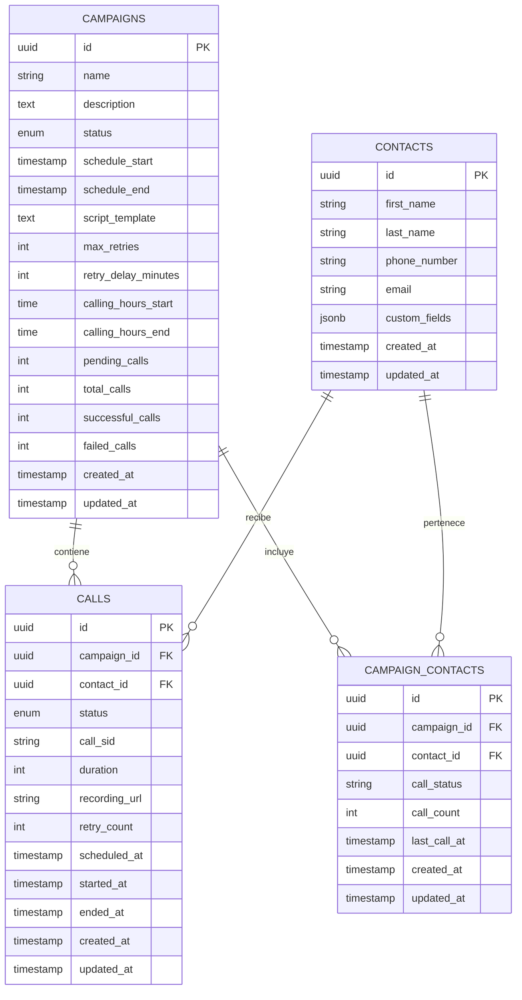

# Esquema de Base de Datos

## Visión General

El sistema de automatización de llamadas utiliza Supabase (PostgreSQL) como base de datos principal. La estructura de la base de datos está diseñada para soportar campañas de llamadas automatizadas, gestión de contactos, y seguimiento de llamadas.

## Diagrama de Entidad-Relación

## Tablas Principales

### Campaigns

La tabla `campaigns` almacena información sobre las campañas de llamadas.

| Campo | Tipo | Descripción |
|-------|------|-------------|
| id | UUID | Identificador único de la campaña (clave primaria) |
| name | VARCHAR(255) | Nombre de la campaña |
| description | TEXT | Descripción detallada de la campaña |
| status | ENUM | Estado de la campaña (draft, active, paused, completed, cancelled) |
| schedule_start | TIMESTAMP | Fecha y hora de inicio programada |
| schedule_end | TIMESTAMP | Fecha y hora de finalización programada |
| script_template | TEXT | Plantilla de script para la conversación |
| max_retries | INTEGER | Número máximo de reintentos para llamadas fallidas |
| retry_delay_minutes | INTEGER | Tiempo de espera entre reintentos (en minutos) |
| calling_hours_start | TIME | Hora de inicio para realizar llamadas |
| calling_hours_end | TIME | Hora de finalización para realizar llamadas |
| pending_calls | INTEGER | Número de llamadas pendientes |
| total_calls | INTEGER | Número total de llamadas en la campaña |
| successful_calls | INTEGER | Número de llamadas exitosas |
| failed_calls | INTEGER | Número de llamadas fallidas |
| created_at | TIMESTAMP | Fecha y hora de creación |
| updated_at | TIMESTAMP | Fecha y hora de última actualización |

### Calls

La tabla `calls` almacena información sobre las llamadas individuales.

| Campo | Tipo | Descripción |
|-------|------|-------------|
| id | UUID | Identificador único de la llamada (clave primaria) |
| campaign_id | UUID | Referencia a la campaña (clave foránea) |
| contact_id | UUID | Referencia al contacto (clave foránea) |
| status | ENUM | Estado de la llamada (scheduled, in_progress, completed, failed, cancelled, pending) |
| call_sid | VARCHAR(255) | Identificador de Twilio para la llamada |
| duration | INTEGER | Duración de la llamada en segundos |
| recording_url | VARCHAR(255) | URL de la grabación de la llamada |
| retry_count | INTEGER | Número de intentos realizados |
| scheduled_at | TIMESTAMP | Fecha y hora programada |
| started_at | TIMESTAMP | Fecha y hora de inicio |
| ended_at | TIMESTAMP | Fecha y hora de finalización |
| created_at | TIMESTAMP | Fecha y hora de creación |
| updated_at | TIMESTAMP | Fecha y hora de última actualización |

### Contacts

La tabla `contacts` almacena información sobre los contactos.

| Campo | Tipo | Descripción |
|-------|------|-------------|
| id | UUID | Identificador único del contacto (clave primaria) |
| first_name | VARCHAR(100) | Nombre del contacto |
| last_name | VARCHAR(100) | Apellido del contacto |
| phone_number | VARCHAR(20) | Número de teléfono |
| email | VARCHAR(255) | Correo electrónico |
| custom_fields | JSONB | Campos personalizados adicionales |
| created_at | TIMESTAMP | Fecha y hora de creación |
| updated_at | TIMESTAMP | Fecha y hora de última actualización |

### Campaign_Contacts

La tabla `campaign_contacts` es una tabla de unión que relaciona campañas con contactos.

| Campo | Tipo | Descripción |
|-------|------|-------------|
| id | UUID | Identificador único (clave primaria) |
| campaign_id | UUID | Referencia a la campaña (clave foránea) |
| contact_id | UUID | Referencia al contacto (clave foránea) |
| call_status | VARCHAR(50) | Estado de la llamada para este contacto en esta campaña |
| call_count | INTEGER | Número de llamadas realizadas a este contacto en esta campaña |
| last_call_at | TIMESTAMP | Fecha y hora de la última llamada |
| created_at | TIMESTAMP | Fecha y hora de creación |
| updated_at | TIMESTAMP | Fecha y hora de última actualización |

## Enumeraciones

### campaign_status

- `draft`: Campaña en borrador, aún no iniciada
- `active`: Campaña activa, realizando llamadas
- `paused`: Campaña pausada temporalmente
- `completed`: Campaña completada
- `cancelled`: Campaña cancelada

### call_status

- `scheduled`: Llamada programada
- `in_progress`: Llamada en curso
- `completed`: Llamada completada
- `failed`: Llamada fallida
- `cancelled`: Llamada cancelada
- `pending`: Llamada pendiente

## Índices

- `campaigns_name_idx`: Índice en el campo `name` de la tabla `campaigns`
- `calls_campaign_id_idx`: Índice en el campo `campaign_id` de la tabla `calls`
- `calls_contact_id_idx`: Índice en el campo `contact_id` de la tabla `calls`
- `contacts_phone_number_idx`: Índice en el campo `phone_number` de la tabla `contacts`
- `campaign_contacts_campaign_id_idx`: Índice en el campo `campaign_id` de la tabla `campaign_contacts`
- `campaign_contacts_contact_id_idx`: Índice en el campo `contact_id` de la tabla `campaign_contacts`

## Restricciones

- `campaigns_dates_check`: Asegura que `schedule_end` sea posterior o igual a `schedule_start`
- `calls_campaign_id_fk`: Clave foránea que relaciona `calls.campaign_id` con `campaigns.id`
- `calls_contact_id_fk`: Clave foránea que relaciona `calls.contact_id` con `contacts.id`
- `campaign_contacts_campaign_id_fk`: Clave foránea que relaciona `campaign_contacts.campaign_id` con `campaigns.id`
- `campaign_contacts_contact_id_fk`: Clave foránea que relaciona `campaign_contacts.contact_id` con `contacts.id`
