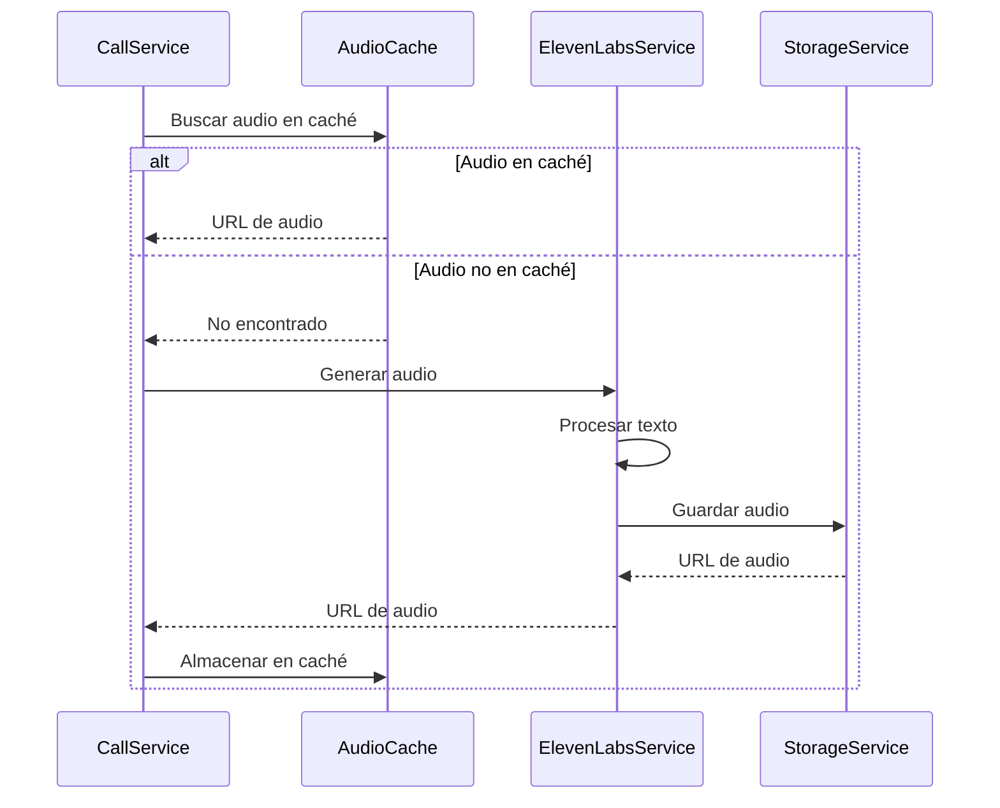
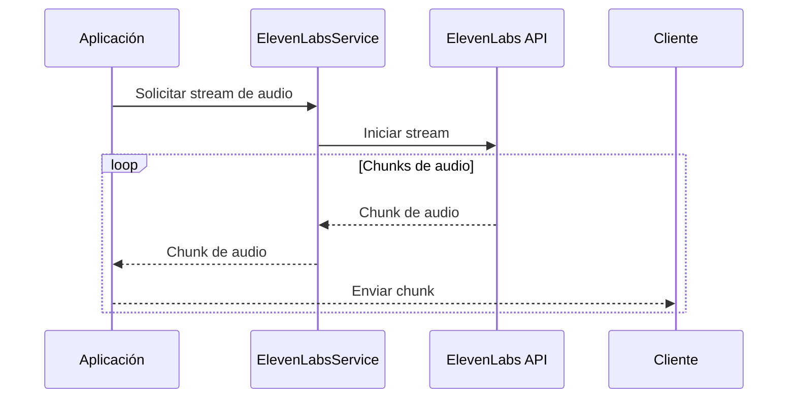

# Integración con ElevenLabs - Sistema de Automatización de Llamadas

## Visión General

La integración con ElevenLabs permite al sistema generar audio de alta calidad a partir de texto para las llamadas automatizadas. ElevenLabs proporciona voces realistas y naturales que mejoran significativamente la experiencia del usuario en comparación con las soluciones tradicionales de texto a voz (TTS).

## Requisitos Previos

### Cuenta de ElevenLabs
- Cuenta activa en [ElevenLabs](https://elevenlabs.io/)
- API Key de ElevenLabs
- Plan adecuado según volumen de uso

### Configuración del Sistema
- Variables de entorno configuradas (ver sección "Variables de Entorno")
- Almacenamiento para archivos de audio generados
- Caché configurada para optimizar uso de API

## Variables de Entorno

```dotenv
# ElevenLabs Configuration
ELEVENLABS_API_KEY=your_elevenlabs_api_key
ELEVENLABS_DEFAULT_VOICE=Bella
ELEVENLABS_MODEL_ID=eleven_multilingual_v2
ELEVENLABS_MAX_RETRIES=3
ELEVENLABS_BACKOFF_FACTOR=2
ELEVENLABS_MAX_CONNECTIONS=10
ELEVENLABS_POOL_TIMEOUT=30
ELEVENLABS_CONNECTION_TIMEOUT=30
```

## Arquitectura de la Integración

```
┌─────────────────┐     ┌─────────────────┐     ┌─────────────────┐
│                 │     │                 │     │                 │
│  CallService    │────▶│ElevenLabsService│────▶│ ElevenLabs API  │
│                 │     │                 │     │                 │
└─────────────────┘     └─────────────────┘     └────────┬────────┘
                                                         │
                                                         ▼
┌─────────────────┐     ┌─────────────────┐     ┌─────────────────┐
│                 │     │                 │     │                 │
│  AudioCache     │◀────│ StorageService  │◀────│  Audio Files    │
│                 │     │                 │     │                 │
└─────────────────┘     └─────────────────┘     └─────────────────┘
```

## Componentes Principales

### ElevenLabsService

El `ElevenLabsService` es el componente principal que encapsula la interacción con la API de ElevenLabs.

```python
class ElevenLabsService:
    def __init__(self, settings=None):
        self.settings = settings or get_settings()
        self.api_key = self.settings.ELEVENLABS_API_KEY
        self.default_voice = self.settings.ELEVENLABS_DEFAULT_VOICE
        self.model_id = self.settings.ELEVENLABS_MODEL_ID
        self.metrics = MetricsService()
        
    @with_retry(max_attempts=3, base_wait=1.0)
    async def generate_audio(self, text: str, voice_id: str = None) -> str:
        """
        Genera audio a partir de texto y devuelve la URL del archivo generado.
        
        Args:
            text: Texto a convertir en audio
            voice_id: ID de la voz a usar (opcional)
            
        Returns:
            URL del archivo de audio generado
        """
        # Implementación para generar audio
        
    @with_retry(max_attempts=3, base_wait=1.0)
    async def generate_stream(self, text: str, voice_id: str = None) -> AsyncGenerator[bytes, None]:
        """
        Genera un stream de audio a partir de texto.
        
        Args:
            text: Texto a convertir en audio
            voice_id: ID de la voz a usar (opcional)
            
        Returns:
            Generador asíncrono de chunks de audio
        """
        # Implementación para generar stream de audio
        
    async def get_voices(self) -> List[Dict[str, Any]]:
        """
        Obtiene la lista de voces disponibles.
        
        Returns:
            Lista de voces disponibles
        """
        # Implementación para obtener voces
```

### AudioCache

El `AudioCache` optimiza el uso de la API de ElevenLabs almacenando en caché los audios generados.

```python
class AudioCache:
    def __init__(self, redis_client=None, storage_service=None):
        self.redis = redis_client or get_redis_client()
        self.storage = storage_service or StorageService()
        
    async def get(self, text: str, voice_id: str) -> Optional[str]:
        """
        Obtiene la URL de un audio en caché.
        
        Args:
            text: Texto original
            voice_id: ID de la voz
            
        Returns:
            URL del audio o None si no está en caché
        """
        # Implementación para obtener audio de caché
        
    async def set(self, text: str, voice_id: str, audio_url: str, ttl: int = 86400) -> None:
        """
        Almacena la URL de un audio en caché.
        
        Args:
            text: Texto original
            voice_id: ID de la voz
            audio_url: URL del audio generado
            ttl: Tiempo de vida en caché (segundos)
        """
        # Implementación para almacenar audio en caché
```

## Flujos de Generación de Audio

### 1. Generación de Audio para Llamada



#### Código de Ejemplo

```python
async def generate_call_audio(text: str, voice_id: str = None) -> str:
    """
    Genera audio para una llamada, utilizando caché si está disponible.
    
    Args:
        text: Texto a convertir en audio
        voice_id: ID de la voz (opcional)
        
    Returns:
        URL del audio generado
    """
    # Normalizar texto para caché
    normalized_text = normalize_text(text)
    voice = voice_id or settings.ELEVENLABS_DEFAULT_VOICE
    
    # Intentar obtener de caché
    cache_key = f"audio:{voice}:{hash(normalized_text)}"
    cached_url = await audio_cache.get(cache_key)
    
    if cached_url:
        logger.info(f"Audio found in cache: {cache_key}")
        metrics.increment("elevenlabs.audio.cache_hit")
        return cached_url
    
    # Generar nuevo audio
    logger.info(f"Generating new audio with voice {voice}")
    metrics.increment("elevenlabs.audio.cache_miss")
    
    start_time = time.time()
    audio_data = await elevenlabs_service.generate_audio(normalized_text, voice)
    generation_time = time.time() - start_time
    
    metrics.timing("elevenlabs.audio.generation_time", generation_time)
    
    # Guardar audio
    filename = f"{uuid.uuid4()}.mp3"
    audio_url = await storage_service.save_audio(filename, audio_data)
    
    # Almacenar en caché
    await audio_cache.set(cache_key, audio_url, ttl=86400)  # 24 horas
    
    return audio_url
```

### 2. Streaming de Audio en Tiempo Real



#### Código de Ejemplo

```python
@router.get("/audio/stream")
async def stream_audio(text: str, voice_id: str = None):
    """
    Endpoint para streaming de audio.
    
    Args:
        text: Texto a convertir en audio
        voice_id: ID de la voz (opcional)
        
    Returns:
        Stream de audio
    """
    voice = voice_id or settings.ELEVENLABS_DEFAULT_VOICE
    
    # Crear respuesta de streaming
    async def generate():
        async for chunk in elevenlabs_service.generate_stream(text, voice):
            yield chunk
    
    return StreamingResponse(
        generate(),
        media_type="audio/mpeg",
        headers={
            "Content-Disposition": f'attachment; filename="audio_{uuid.uuid4()}.mp3"'
        }
    )
```

## Voces Disponibles

ElevenLabs ofrece una variedad de voces con diferentes características. A continuación se presentan algunas de las voces más utilizadas en el sistema:

| ID de Voz | Nombre    | Género    | Idiomas                  | Características                      |
|-----------|-----------|-----------|--------------------------|--------------------------------------|
| pNInz6obpgDQGcFmaJgB | Adam      | Masculino | Inglés, Español          | Profesional, confiable              |
| EXAVITQu4vr4xnSDxMaL | Sarah     | Femenino  | Inglés, Español, Francés | Cálida, amigable                    |
| 21m00Tcm4TlvDq8ikWAM | Michael   | Masculino | Inglés                   | Autoritario, formal                 |
| AZnzlk1XvdvUeBnXmlld | Bella     | Femenino  | Español, Inglés          | Energética, juvenil                 |
| MF3mGyEYCl7XYWbV9V6O | Elli      | Femenino  | Inglés, Alemán           | Tranquila, reconfortante            |
| TxGEqnHWrfWFTfGW9XjX | Josh      | Masculino | Inglés                   | Conversacional, natural             |

### Selección de Voces por Tipo de Campaña

Para optimizar la experiencia del usuario, se recomienda seleccionar voces específicas según el tipo de campaña:

| Tipo de Campaña | Voces Recomendadas | Justificación                                  |
|-----------------|--------------------|-------------------------------------------------|
| Ventas          | Adam, Sarah        | Voces confiables y persuasivas                  |
| Soporte         | Bella, Elli        | Voces amigables y reconfortantes                |
| Encuestas       | Michael, Josh      | Voces claras y neutrales                        |
| Recordatorios   | Sarah, Elli        | Voces cálidas y no intrusivas                   |
| Emergencias     | Adam, Michael      | Voces autoritarias y que transmiten urgencia    |

## Personalización de Voz

ElevenLabs permite personalizar aspectos de las voces para adaptarlas a diferentes necesidades:

### Parámetros de Voz

| Parámetro        | Descripción                                   | Rango      | Valor Predeterminado |
|------------------|-----------------------------------------------|------------|----------------------|
| stability        | Estabilidad de la voz                         | 0.0 - 1.0  | 0.5                  |
| similarity_boost | Similitud con la voz original                 | 0.0 - 1.0  | 0.75                 |
| style            | Intensidad del estilo de habla                | 0.0 - 1.0  | 0.0                  |
| use_speaker_boost| Mejora la calidad del altavoz                 | boolean    | true                 |

### Ejemplo de Configuración

```python
voice_settings = {
    "stability": 0.5,
    "similarity_boost": 0.75,
    "style": 0.3,
    "use_speaker_boost": True
}

audio_url = await elevenlabs_service.generate_audio(
    text="Hola, ¿cómo estás hoy?",
    voice_id="AZnzlk1XvdvUeBnXmlld",  # Bella
    voice_settings=voice_settings
)
```

## Optimización de Texto

Para obtener los mejores resultados con ElevenLabs, es importante optimizar el texto que se envía a la API:

### Mejores Prácticas

1. **Formato Natural**:
   - Usar puntuación adecuada
   - Incluir pausas naturales (comas, puntos)
   - Evitar abreviaturas poco comunes

2. **Pronunciación**:
   - Usar SSML para palabras difíciles
   - Deletrear fonéticamente nombres propios complejos
   - Especificar pronunciación de números y fechas

3. **Emociones y Énfasis**:
   - Usar signos de exclamación para énfasis
   - Incluir indicaciones de emoción entre paréntesis
   - Utilizar puntos suspensivos para pausas más largas

### Ejemplo de Optimización

**Texto Original**:
```
Hola Sr. Pérez, le llamamos de ABC Corp. para informarle que su pedido #12345 está listo para entrega el 15/07.
```

**Texto Optimizado**:
```
Hola, Señor Pérez. Le llamamos de ABC Corp para informarle que su pedido número doce tres cuatro cinco está listo para entrega el quince de julio.
```

## Manejo de Errores

### Errores Comunes de ElevenLabs

| Código | Descripción                                   | Acción Recomendada                           |
|--------|-----------------------------------------------|----------------------------------------------|
| 400    | Parámetros inválidos                          | Verificar formato de solicitud               |
| 401    | API Key inválida                              | Verificar credenciales                        |
| 403    | Límite de uso excedido                        | Actualizar plan o esperar reset de cuota     |
| 429    | Demasiadas solicitudes                        | Implementar backoff exponencial              |
| 500    | Error interno del servidor                    | Reintentar con backoff                       |

### Implementación de Reintentos

```python
def with_retry(max_attempts=3, base_wait=1.0):
    """
    Decorador para reintentar funciones con backoff exponencial.
    
    Args:
        max_attempts: Número máximo de intentos
        base_wait: Tiempo base de espera (segundos)
    """
    def decorator(func):
        @functools.wraps(func)
        async def wrapper(*args, **kwargs):
            last_exception = None
            for attempt in range(1, max_attempts + 1):
                try:
                    return await func(*args, **kwargs)
                except Exception as e:
                    last_exception = e
                    if attempt < max_attempts:
                        wait_time = base_wait * (2 ** (attempt - 1))
                        logger.warning(
                            f"Attempt {attempt} failed: {str(e)}. "
                            f"Retrying in {wait_time:.2f} seconds..."
                        )
                        await asyncio.sleep(wait_time)
                    else:
                        logger.error(
                            f"All {max_attempts} attempts failed. "
                            f"Last error: {str(e)}"
                        )
            raise last_exception
        return wrapper
    return decorator
```

## Optimización de Costos

### Estrategias para Reducir Costos

1. **Caché de Audio**:
   - Almacenar audios generados para reutilización
   - Implementar TTL basado en frecuencia de uso

2. **Optimización de Texto**:
   - Eliminar texto redundante
   - Dividir textos largos en segmentos más pequeños

3. **Selección de Modelo**:
   - Usar modelos más ligeros para casos simples
   - Reservar modelos premium para casos críticos

4. **Monitoreo de Uso**:
   - Establecer alertas de uso
   - Implementar cuotas por campaña

### Implementación de Caché

```python
async def get_or_generate_audio(text: str, voice_id: str) -> str:
    """
    Obtiene audio de caché o genera nuevo si no existe.
    
    Args:
        text: Texto a convertir
        voice_id: ID de la voz
        
    Returns:
        URL del audio
    """
    # Generar clave de caché
    cache_key = f"audio:{voice_id}:{hashlib.md5(text.encode()).hexdigest()}"
    
    # Intentar obtener de caché
    cached_url = await redis_client.get(cache_key)
    if cached_url:
        return cached_url.decode('utf-8')
    
    # Generar nuevo audio
    audio_data = await elevenlabs_service.generate_audio(text, voice_id)
    
    # Guardar en almacenamiento
    filename = f"{uuid.uuid4()}.mp3"
    audio_url = await storage_service.upload_file(
        bucket_name="audio-files",
        file_path=filename,
        file_content=audio_data,
        content_type="audio/mpeg"
    )
    
    # Guardar en caché
    await redis_client.set(
        cache_key,
        audio_url,
        ex=86400  # 24 horas
    )
    
    return audio_url
```

## Monitoreo y Métricas

### Métricas Clave

1. **Uso de API**:
   - Número de solicitudes
   - Caracteres procesados
   - Tiempo de respuesta

2. **Caché**:
   - Tasa de aciertos/fallos
   - Tamaño de caché
   - TTL promedio

3. **Calidad**:
   - Errores de generación
   - Reintentos
   - Tiempo de generación

### Implementación de Métricas

```python
class MetricsService:
    def __init__(self):
        self.prefix = "elevenlabs"
        
    def increment(self, metric: str, value: int = 1, tags: Dict[str, str] = None):
        """Incrementa un contador."""
        full_metric = f"{self.prefix}.{metric}"
        # Implementación específica de métricas (Prometheus, StatsD, etc.)
        
    def timing(self, metric: str, value: float, tags: Dict[str, str] = None):
        """Registra una métrica de tiempo."""
        full_metric = f"{self.prefix}.{metric}"
        # Implementación específica de métricas
        
    def gauge(self, metric: str, value: float, tags: Dict[str, str] = None):
        """Registra un valor actual."""
        full_metric = f"{self.prefix}.{metric}"
        # Implementación específica de métricas
```

### Dashboard de Ejemplo

```
┌─────────────────────────────────────────────────────────────────────┐
│                      ElevenLabs API Usage                            │
├─────────────────┬─────────────────┬─────────────────────────────────┤
│ Total Requests  │ Characters      │ Average Response Time           │
│ 1,234           │ 567,890         │ 1.23s                           │
├─────────────────┴─────────────────┴─────────────────────────────────┤
│                                                                     │
│  ┌─────────────────────────────────┐  ┌─────────────────────────┐   │
│  │ Requests per Hour               │  │ Cache Hit Rate          │   │
│  │                                 │  │                         │   │
│  │                                 │  │                         │   │
│  │                                 │  │                         │   │
│  └─────────────────────────────────┘  └─────────────────────────┘   │
│                                                                     │
│  ┌─────────────────────────────────┐  ┌─────────────────────────┐   │
│  │ Errors per Hour                 │  │ Characters per Voice     │   │
│  │                                 │  │                         │   │
│  │                                 │  │                         │   │
│  │                                 │  │                         │   │
│  └─────────────────────────────────┘  └─────────────────────────┘   │
│                                                                     │
└─────────────────────────────────────────────────────────────────────┘
```

## Pruebas

### Pruebas Unitarias

```python
def test_generate_audio():
    # Configurar mock de ElevenLabs
    mock_response = MagicMock()
    mock_response.content = b"audio data"
    mock_response.status_code = 200
    
    # Inyectar mock en servicio
    elevenlabs_service = ElevenLabsService()
    elevenlabs_service._make_request = AsyncMock(return_value=mock_response)
    
    # Ejecutar función
    result = await elevenlabs_service.generate_audio(
        text="Hola, ¿cómo estás?",
        voice_id="test-voice"
    )
    
    # Verificar resultado
    assert result == b"audio data"
    
    # Verificar que se llamó a la API con los parámetros correctos
    elevenlabs_service._make_request.assert_called_once()
    call_args = elevenlabs_service._make_request.call_args[0]
    assert call_args[0] == "POST"
    assert "text-to-speech" in call_args[1]
    assert "test-voice" in call_args[1]
```

### Pruebas de Integración

```python
def test_audio_cache():
    # Configurar servicios
    redis_client = FakeRedis()
    storage_service = MockStorageService()
    elevenlabs_service = MockElevenLabsService()
    
    # Crear instancia de caché
    audio_cache = AudioCache(redis_client, storage_service)
    
    # Caso 1: Audio no en caché
    audio_url = await get_or_generate_audio(
        "Hola, ¿cómo estás?",
        "test-voice",
        audio_cache,
        elevenlabs_service,
        storage_service
    )
    
    # Verificar que se generó nuevo audio
    assert elevenlabs_service.generate_audio.called
    assert storage_service.upload_file.called
    assert audio_url == "https://example.com/audio/test.mp3"
    
    # Caso 2: Audio en caché
    elevenlabs_service.generate_audio.reset_mock()
    storage_service.upload_file.reset_mock()
    
    audio_url_2 = await get_or_generate_audio(
        "Hola, ¿cómo estás?",
        "test-voice",
        audio_cache,
        elevenlabs_service,
        storage_service
    )
    
    # Verificar que se usó la caché
    assert not elevenlabs_service.generate_audio.called
    assert not storage_service.upload_file.called
    assert audio_url_2 == audio_url
```

## Mejores Prácticas

1. **Optimización de Texto**:
   - Usar puntuación adecuada
   - Incluir pausas naturales
   - Evitar abreviaturas poco comunes

2. **Gestión de Recursos**:
   - Implementar caché para audios frecuentes
   - Usar streaming para audios largos
   - Monitorear uso de API

3. **Calidad de Audio**:
   - Seleccionar voces apropiadas para cada caso
   - Ajustar parámetros de voz según necesidad
   - Probar diferentes configuraciones

4. **Manejo de Errores**:
   - Implementar reintentos con backoff
   - Tener fallbacks para casos críticos
   - Monitorear y alertar sobre errores

5. **Seguridad**:
   - Proteger API keys
   - Validar contenido de texto
   - Implementar límites de uso

## Referencias

- [Documentación de ElevenLabs](https://docs.elevenlabs.io/)
- [API de ElevenLabs](https://api.elevenlabs.io/docs)
- [Guía de Voces](https://elevenlabs.io/docs/voices/voice-library)
- [Optimización de Texto](https://elevenlabs.io/docs/text-to-speech/text-optimization)
- [Mejores Prácticas de API](https://elevenlabs.io/docs/api/best-practices)
