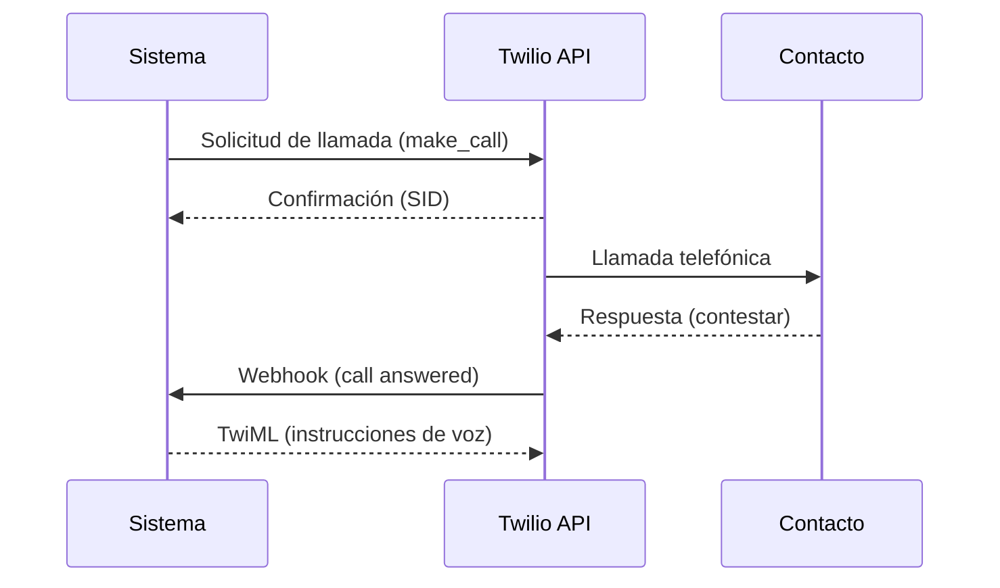
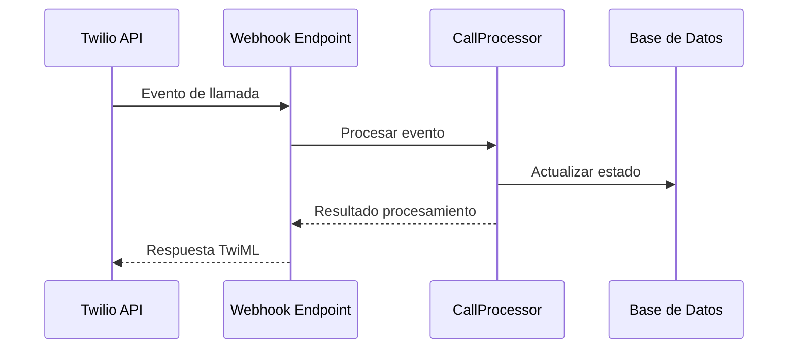
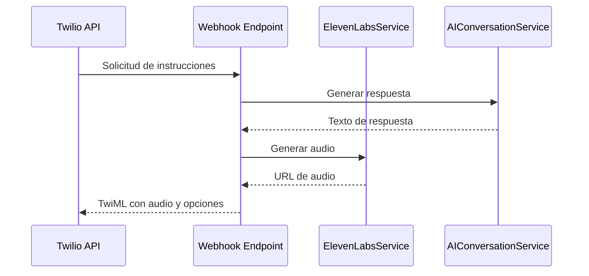

# Integración con Twilio - Sistema de Automatización de Llamadas

## Visión General

La integración con Twilio permite al sistema realizar llamadas telefónicas automatizadas, recibir eventos de estado de llamadas y procesar interacciones de voz. Esta documentación detalla cómo se implementa y utiliza la integración con Twilio en el Sistema de Automatización de Llamadas.

## Requisitos Previos

### Cuenta de Twilio
- Cuenta activa en [Twilio](https://www.twilio.com/)
- SID de cuenta y token de autenticación
- Número de teléfono de Twilio verificado

### Configuración del Sistema
- Variables de entorno configuradas (ver sección "Variables de Entorno")
- Endpoints de webhook accesibles públicamente
- Certificados SSL válidos para endpoints de webhook

## Variables de Entorno

```dotenv
# Twilio Configuration
TWILIO_ACCOUNT_SID=your_twilio_account_sid
TWILIO_AUTH_TOKEN=your_twilio_auth_token
TWILIO_PHONE_NUMBER=your_twilio_phone_number
TWILIO_WEBHOOK_BASE_URL=https://your-api.example.com
```

## Arquitectura de la Integración

```
┌─────────────────┐     ┌─────────────────┐     ┌─────────────────┐
│                 │     │                 │     │                 │
│  CallService    │────▶│  TwilioService  │────▶│   Twilio API    │
│                 │     │                 │     │                 │
└─────────────────┘     └─────────────────┘     └────────┬────────┘
                                                         │
                                                         ▼
┌─────────────────┐     ┌─────────────────┐     ┌─────────────────┐
│                 │     │                 │     │                 │
│  CallProcessor  │◀────│  CallWebhook    │◀────│  Twilio Events  │
│                 │     │                 │     │                 │
└─────────────────┘     └─────────────────┘     └─────────────────┘
```

## Componentes Principales

### TwilioService

El `TwilioService` es el componente principal que encapsula la interacción con la API de Twilio.

```python
class TwilioService:
    def __init__(self):
        self.account_sid = settings.TWILIO_ACCOUNT_SID
        self.auth_token = settings.TWILIO_AUTH_TOKEN
        self.client = Client(self.account_sid, self.auth_token)
        
    async def make_call(self, to: str, from_: str, url: str, 
                        status_callback: Optional[str] = None, 
                        timeout: int = 30) -> Dict[str, Any]:
        # Implementación para realizar llamadas
        
    async def get_call_status(self, call_sid: str) -> Dict[str, Any]:
        # Implementación para obtener estado de llamada
        
    async def end_call(self, call_sid: str) -> bool:
        # Implementación para finalizar llamada
```

### CallWebhook

El `CallWebhook` maneja los eventos entrantes de Twilio y genera respuestas TwiML.

```python
@router.post("/webhooks/twilio")
async def twilio_webhook(request: Request):
    # Validar solicitud de Twilio
    # Procesar evento
    # Generar respuesta TwiML
```

## Flujos de Llamada

### 1. Iniciar Llamada



#### Código de Ejemplo

```python
# Iniciar llamada
call_data = await twilio_service.make_call(
    to="+34600123456",
    from_=settings.TWILIO_PHONE_NUMBER,
    url=f"{settings.TWILIO_WEBHOOK_BASE_URL}/api/webhooks/twilio",
    status_callback=f"{settings.TWILIO_WEBHOOK_BASE_URL}/api/webhooks/call-status"
)

# Guardar información de llamada
call = Call(
    id=str(uuid.uuid4()),
    campaign_id=campaign_id,
    contact_id=contact_id,
    status=CallStatus.PENDING,
    twilio_sid=call_data["sid"],
    # ... otros campos
)
await call_repository.create(call)
```

### 2. Manejo de Eventos de Llamada



#### Código de Ejemplo

```python
@router.post("/webhooks/call-status")
async def call_status_webhook(request: Request):
    form_data = await request.form()
    call_sid = form_data.get("CallSid")
    call_status = form_data.get("CallStatus")
    
    # Buscar llamada por SID
    call = await call_repository.find_by_twilio_sid(call_sid)
    if not call:
        raise HTTPException(status_code=404, detail="Call not found")
    
    # Actualizar estado
    if call_status == "completed":
        call.status = CallStatus.COMPLETED
        call.duration = int(form_data.get("CallDuration", 0))
        call.recording_url = form_data.get("RecordingUrl")
    elif call_status == "failed":
        call.status = CallStatus.FAILED
        call.error_message = form_data.get("ErrorMessage")
    # ... otros estados
    
    await call_repository.update(call)
    
    return {"success": True}
```

### 3. Generación de Respuestas TwiML



#### Código de Ejemplo

```python
@router.post("/webhooks/twilio")
async def twilio_webhook(request: Request):
    form_data = await request.form()
    call_sid = form_data.get("CallSid")
    
    # Obtener información de la llamada
    call = await call_repository.find_by_twilio_sid(call_sid)
    if not call:
        raise HTTPException(status_code=404, detail="Call not found")
    
    # Obtener contacto
    contact = await contact_repository.find_by_id(call.contact_id)
    
    # Generar respuesta con IA
    ai_response = await ai_conversation_service.generate_response(
        conversation_id=str(call.id),
        message="",  # Mensaje inicial vacío para primer turno
        context={
            "contact_name": contact.name,
            "campaign_name": call.campaign_name,
            "script_template": call.script_template
        }
    )
    
    # Generar audio con ElevenLabs
    audio_url = await elevenlabs_service.generate_audio(ai_response["response"])
    
    # Crear respuesta TwiML
    response = VoiceResponse()
    response.play(audio_url)
    
    # Añadir opciones de interacción
    gather = Gather(input='dtmf speech', timeout=3, action=f"{settings.TWILIO_WEBHOOK_BASE_URL}/api/webhooks/twilio/gather")
    gather.say("Presiona 1 para más información, o di 'interesado' si quieres que te contactemos.")
    response.append(gather)
    
    # Fallback si no hay respuesta
    response.say("No hemos recibido respuesta. Gracias por tu tiempo.")
    response.hangup()
    
    return Response(content=str(response), media_type="application/xml")
```

## Tipos de Eventos de Twilio

| Evento          | Descripción                                   | Acción                                      |
|-----------------|-----------------------------------------------|---------------------------------------------|
| initiated       | Llamada iniciada                              | Actualizar estado a PENDING                 |
| ringing         | Teléfono sonando                              | Actualizar estado a RINGING                 |
| in-progress     | Llamada en curso                              | Actualizar estado a IN_PROGRESS             |
| completed       | Llamada completada                            | Actualizar estado a COMPLETED, guardar datos|
| busy            | Número ocupado                                | Actualizar estado a BUSY, programar reintento|
| no-answer       | Sin respuesta                                 | Actualizar estado a NO_ANSWER, programar reintento|
| failed          | Error en la llamada                           | Actualizar estado a FAILED, registrar error |
| canceled        | Llamada cancelada                             | Actualizar estado a CANCELED                |

## Manejo de Respuestas TwiML

TwiML (Twilio Markup Language) es un conjunto de instrucciones XML que le dicen a Twilio cómo manejar llamadas o mensajes.

### Elementos TwiML Comunes

| Elemento | Descripción                                   | Ejemplo                                      |
|----------|-----------------------------------------------|----------------------------------------------|
| Say      | Texto a voz                                   | `<Say>Hola, ¿cómo estás?</Say>`              |
| Play     | Reproducir audio                              | `<Play>https://example.com/audio.mp3</Play>` |
| Gather   | Recopilar entrada (DTMF o voz)                | `<Gather timeout="3" input="dtmf speech">...</Gather>` |
| Record   | Grabar audio                                  | `<Record maxLength="30" playBeep="true" />` |
| Dial     | Conectar con otro número                      | `<Dial>+34600123456</Dial>`                  |
| Hangup   | Finalizar llamada                             | `<Hangup />`                                 |

### Ejemplo de Respuesta TwiML Completa

```xml
<?xml version="1.0" encoding="UTF-8"?>
<Response>
    <Say voice="woman">Hola Juan, te llamo de Empresa ABC para hablarte sobre nuestras ofertas.</Say>
    <Play>https://storage.example.com/audios/campaign_intro.mp3</Play>
    <Gather input="dtmf speech" timeout="5" numDigits="1" action="/api/webhooks/twilio/gather">
        <Say>Presiona 1 o di 'interesado' si quieres más información, o presiona 2 si prefieres que te llamemos más tarde.</Say>
    </Gather>
    <Say>No hemos recibido respuesta. Te llamaremos en otro momento. Gracias.</Say>
    <Hangup />
</Response>
```

## Webhooks

### Configuración de Webhooks

Los webhooks deben ser configurados para ser accesibles públicamente y manejar los eventos de Twilio.

#### Endpoints Requeridos

1. **Webhook Principal**: `/api/webhooks/twilio`
   - Maneja la lógica principal de la llamada
   - Genera respuestas TwiML

2. **Webhook de Estado**: `/api/webhooks/call-status`
   - Recibe actualizaciones de estado de llamada
   - Actualiza registros en base de datos

3. **Webhook de Recopilación**: `/api/webhooks/twilio/gather`
   - Procesa entradas del usuario (DTMF o voz)
   - Genera respuestas TwiML basadas en la entrada

### Seguridad de Webhooks

Para garantizar que las solicitudes provienen realmente de Twilio:

1. **Validación de Firma**:
   ```python
   def validate_twilio_request(request: Request) -> bool:
       # Obtener la firma de Twilio del encabezado
       twilio_signature = request.headers.get("X-Twilio-Signature")
       if not twilio_signature:
           return False
       
       # Construir la URL completa
       url = str(request.url)
       
       # Obtener los parámetros de la solicitud
       form_data = await request.form()
       params = dict(form_data)
       
       # Validar la firma
       validator = RequestValidator(settings.TWILIO_AUTH_TOKEN)
       return validator.validate(url, params, twilio_signature)
   ```

2. **Filtrado por IP**:
   - Opcional: Restringir acceso a IPs de Twilio
   - Lista de IPs de Twilio disponible en [IP Addresses for Twilio's Services](https://www.twilio.com/docs/api/security/ip-addresses)

## Manejo de Errores

### Errores Comunes de Twilio

| Código | Descripción                                   | Acción Recomendada                           |
|--------|-----------------------------------------------|----------------------------------------------|
| 13201  | Número de teléfono inválido                   | Validar formato de número                    |
| 13214  | Número de teléfono no permitido               | Verificar restricciones geográficas          |
| 13222  | Número de teléfono no verificado              | Verificar número en consola de Twilio        |
| 13223  | Saldo insuficiente                            | Recargar cuenta de Twilio                    |
| 20404  | Recurso no encontrado                         | Verificar SID de llamada                     |
| 30003  | Llamada no contestada                         | Programar reintento                          |
| 30004  | Número ocupado                                | Programar reintento                          |
| 30007  | Llamada fallida                               | Registrar error y notificar                  |

### Estrategia de Reintentos

Para manejar errores transitorios:

```python
async def retry_call(call_id: str, retry_delay: int = 60):
    # Obtener información de la llamada
    call = await call_repository.find_by_id(call_id)
    if not call:
        logger.error(f"Call not found for retry: {call_id}")
        return
    
    # Verificar límite de reintentos
    if call.retry_attempts >= call.max_retries:
        logger.info(f"Max retries reached for call: {call_id}")
        call.status = CallStatus.FAILED
        call.error_message = "Max retries reached"
        await call_repository.update(call)
        return
    
    # Incrementar contador de reintentos
    call.retry_attempts += 1
    await call_repository.update(call)
    
    # Programar reintento
    scheduled_time = datetime.now() + timedelta(minutes=retry_delay)
    
    # Crear tarea programada
    await scheduler.schedule_task(
        task_name="make_call",
        run_at=scheduled_time,
        task_data={
            "call_id": call_id,
            "campaign_id": call.campaign_id,
            "contact_id": call.contact_id
        }
    )
    
    logger.info(f"Call {call_id} scheduled for retry at {scheduled_time}")
```

## Optimización de Costos

### Estrategias para Reducir Costos

1. **Duración de Llamadas**:
   - Limitar duración máxima de llamadas
   - Finalizar llamadas sin respuesta rápidamente

2. **Horarios Óptimos**:
   - Programar llamadas en horarios con mayor tasa de respuesta
   - Evitar llamadas en horarios no laborables

3. **Filtrado de Números**:
   - Validar números antes de llamar
   - Excluir números inválidos o en listas de exclusión

4. **Reintentos Inteligentes**:
   - Implementar estrategia de reintentos basada en motivo de fallo
   - Limitar número máximo de reintentos

### Ejemplo de Configuración de Campaña Optimizada

```json
{
  "name": "Campaña Optimizada",
  "max_call_duration": 300,
  "calling_hours_start": "09:00",
  "calling_hours_end": "18:00",
  "excluded_days": ["Saturday", "Sunday"],
  "max_retries": 2,
  "retry_delays": {
    "no-answer": 60,
    "busy": 30,
    "failed": 120
  }
}
```

## Monitoreo y Logging

### Métricas Clave

1. **Volumen de Llamadas**:
   - Llamadas totales
   - Llamadas por campaña
   - Llamadas por estado

2. **Tasas de Éxito**:
   - Tasa de respuesta
   - Tasa de conversión
   - Tasa de error

3. **Duración**:
   - Duración promedio de llamadas
   - Tiempo de espera promedio

4. **Costos**:
   - Costo por llamada
   - Costo por campaña
   - Costo por conversión

### Implementación de Logging

```python
# Configuración de logger
logger = logging.getLogger("twilio_service")

# Ejemplo de logging en TwilioService
async def make_call(self, to: str, from_: str, url: str, 
                    status_callback: Optional[str] = None, 
                    timeout: int = 30) -> Dict[str, Any]:
    try:
        logger.info(f"Initiating call to {to} from {from_}")
        
        # Realizar llamada con Twilio
        call = self.client.calls.create(
            to=to,
            from_=from_,
            url=url,
            status_callback=status_callback,
            timeout=timeout
        )
        
        logger.info(f"Call initiated successfully: {call.sid}")
        
        return {
            'sid': call.sid,
            'status': call.status,
            'direction': call.direction,
            'from': call.from_,
            'to': call.to
        }
    except TwilioRestException as e:
        logger.error(f"Twilio error: {str(e)}", exc_info=True)
        # Registrar métricas de error
        metrics.increment("twilio.call.error", tags={"error_code": e.code})
        raise
    except Exception as e:
        logger.error(f"Unexpected error: {str(e)}", exc_info=True)
        metrics.increment("twilio.call.unexpected_error")
        raise
```

## Pruebas

### Pruebas Unitarias

```python
def test_make_call():
    # Configurar mock de Twilio
    mock_calls = MagicMock()
    mock_calls.create.return_value = MagicMock(
        sid="CA123456789",
        status="queued",
        direction="outbound-api",
        from_="+12025550142",
        to="+34600123456"
    )
    
    # Inyectar mock en servicio
    twilio_service = TwilioService()
    twilio_service.client = MagicMock()
    twilio_service.client.calls = mock_calls
    
    # Ejecutar función
    result = await twilio_service.make_call(
        to="+34600123456",
        from_="+12025550142",
        url="https://example.com/webhook"
    )
    
    # Verificar resultado
    assert result["sid"] == "CA123456789"
    assert result["status"] == "queued"
    
    # Verificar que se llamó a Twilio con los parámetros correctos
    mock_calls.create.assert_called_once_with(
        to="+34600123456",
        from_="+12025550142",
        url="https://example.com/webhook",
        status_callback=None,
        timeout=30
    )
```

### Pruebas de Integración

```python
def test_twilio_webhook():
    # Crear solicitud simulada
    form_data = {
        "CallSid": "CA123456789",
        "CallStatus": "in-progress",
        "Called": "+34600123456",
        "Caller": "+12025550142"
    }
    
    # Simular firma de Twilio
    signature = generate_twilio_signature(
        settings.TWILIO_AUTH_TOKEN,
        "https://example.com/api/webhooks/twilio",
        form_data
    )
    
    # Realizar solicitud
    response = client.post(
        "/api/webhooks/twilio",
        data=form_data,
        headers={"X-Twilio-Signature": signature}
    )
    
    # Verificar respuesta
    assert response.status_code == 200
    assert "<?xml" in response.text
    assert "<Response>" in response.text
```

## Mejores Prácticas

1. **Seguridad**:
   - Validar todas las solicitudes de webhook
   - Utilizar HTTPS para todas las URLs
   - Mantener tokens de autenticación seguros

2. **Rendimiento**:
   - Responder a webhooks rápidamente (< 10s)
   - Implementar procesamiento asíncrono para tareas largas
   - Utilizar caché para datos frecuentemente accedidos

3. **Robustez**:
   - Implementar reintentos con backoff exponencial
   - Manejar todos los posibles estados de llamada
   - Implementar circuit breaker para evitar cascada de fallos

4. **Monitoreo**:
   - Registrar todas las interacciones con Twilio
   - Configurar alertas para errores críticos
   - Monitorear costos y uso

## Referencias

- [Documentación de Twilio](https://www.twilio.com/docs)
- [API de Twilio para Python](https://www.twilio.com/docs/libraries/python)
- [TwiML Reference](https://www.twilio.com/docs/voice/twiml)
- [Webhooks y Seguridad](https://www.twilio.com/docs/usage/webhooks/webhooks-security)
- [Códigos de Error de Twilio](https://www.twilio.com/docs/api/errors)
