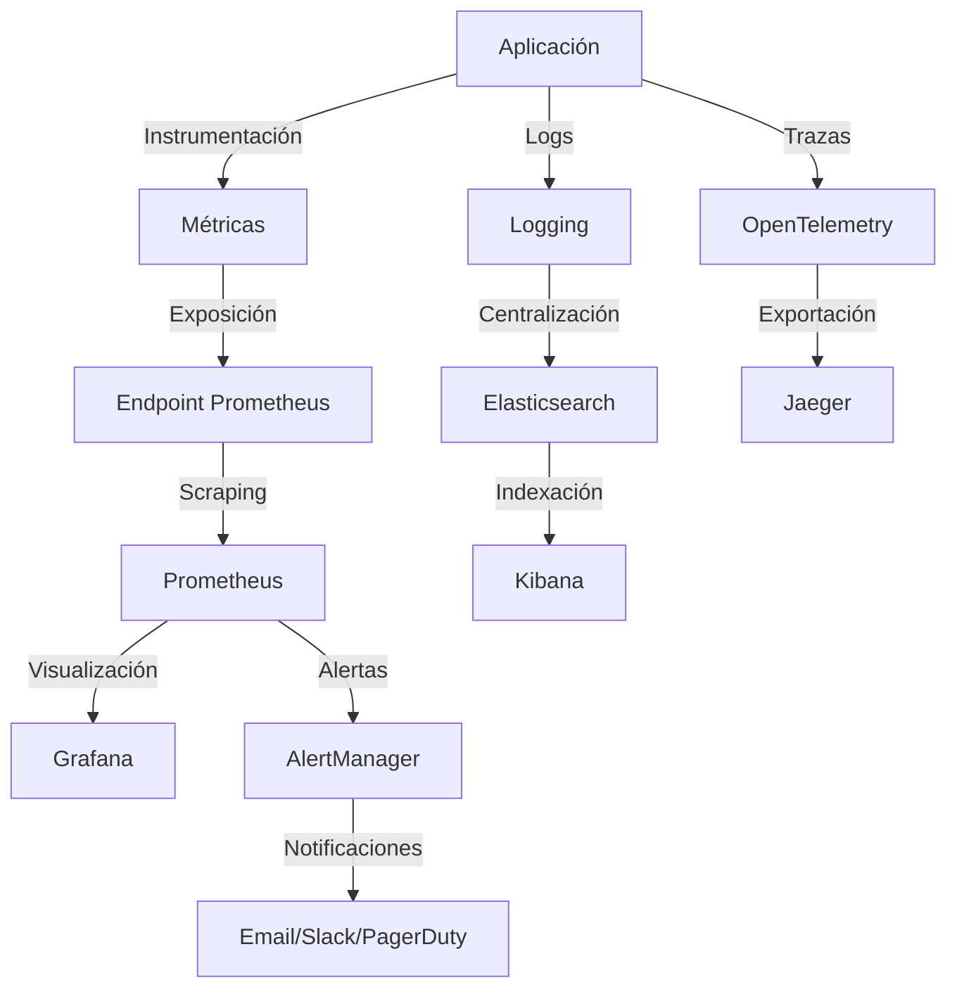

# Guía de Monitoreo

## Visión General

El sistema de automatización de llamadas implementa un robusto sistema de monitoreo que permite seguir el rendimiento, la calidad y el estado de los diferentes componentes del sistema. Esta guía describe la arquitectura de monitoreo, las métricas recopiladas, las herramientas utilizadas y las mejores prácticas para monitorear el sistema en producción.

## Arquitectura de Monitoreo

El sistema de monitoreo se compone de los siguientes componentes:

1. **Recopilación de Métricas**: Instrumentación del código para recopilar métricas en tiempo real
2. **Exposición de Métricas**: Endpoint Prometheus para exponer métricas en formato estándar
3. **Almacenamiento de Métricas**: Prometheus para almacenar series temporales de métricas
4. **Visualización**: Grafana para crear dashboards y visualizar métricas
5. **Alertas**: Sistema de alertas basado en umbrales y patrones
6. **Trazabilidad**: OpenTelemetry para trazabilidad distribuida

### Diagrama de Arquitectura



## Métricas Recopiladas

El sistema recopila las siguientes categorías de métricas:

### Métricas de Llamadas

| Nombre | Tipo | Descripción |
|--------|------|-------------|
| `call_latency_seconds` | Histogram | Latencia de las llamadas en segundos |
| `audio_quality_score` | Gauge | Puntuación de calidad del audio (0-1) |
| `total_calls` | Counter | Número total de llamadas realizadas |
| `call_duration_seconds` | Histogram | Duración de las llamadas en segundos |

### Métricas de IA

| Nombre | Tipo | Descripción |
|--------|------|-------------|
| `ai_response_time_seconds` | Histogram | Tiempo de respuesta de la IA en segundos |
| `ai_requests_total` | Counter | Número total de solicitudes a la IA |
| `ai_errors_total` | Counter | Número total de errores de la IA |
| `ai_sentiment_score` | Gauge | Puntuación de sentimiento detectado por la IA |
| `ai_tokens_used` | Summary | Número de tokens utilizados en solicitudes de IA |

### Métricas de ElevenLabs

| Nombre | Tipo | Descripción |
|--------|------|-------------|
| `elevenlabs_requests_total` | Counter | Número total de solicitudes a ElevenLabs |
| `elevenlabs_request_duration_seconds` | Histogram | Latencia de solicitudes a ElevenLabs |
| `elevenlabs_pool_connections_active` | Gauge | Número de conexiones activas en el pool |
| `elevenlabs_pool_size` | Gauge | Tamaño configurado del pool de conexiones |
| `elevenlabs_errors_total` | Counter | Número total de errores específicos |
| `elevenlabs_generation_duration_seconds` | Histogram | Duración de la generación de audio |
| `elevenlabs_audio_quality_score` | Histogram | Calidad del audio generado |

### Métricas del Sistema

| Nombre | Tipo | Descripción |
|--------|------|-------------|
| `http_requests_total` | Counter | Número total de solicitudes HTTP |
| `http_request_duration_seconds` | Histogram | Duración de las solicitudes HTTP |
| `process_cpu_seconds_total` | Counter | Tiempo total de CPU utilizado |
| `process_resident_memory_bytes` | Gauge | Memoria residente utilizada |

## Servicios de Monitoreo

### MonitoringService

El `MonitoringService` es el componente principal para el monitoreo del sistema. Proporciona métodos para registrar métricas y crear trazas distribuidas.

```python
class MonitoringService:
    """Servicio principal de monitoreo que integra métricas y trazabilidad."""

    def __init__(self):
        """Inicializa el servicio de monitoreo con clientes para métricas y trazas."""
        self.metrics_client = MetricsClient()
        self.tracing_client = OpenTelemetryClient()

    async def record_call_metrics(self, call_id: str, metrics: dict[str, float]):
        """Registra métricas de llamada en Prometheus."""
        # Implementación...

    async def trace_call_flow(self, call_id: str, context: dict[str, Any]):
        """Implementa trazabilidad distribuida para seguir el flujo de una llamada."""
        # Implementación...
```

### MetricsClient

El `MetricsClient` proporciona una interfaz unificada para registrar diferentes tipos de métricas utilizando la biblioteca prometheus_client.

```python
class MetricsClient:
    """Cliente para enviar métricas a Prometheus."""

    def histogram(self, name: str, value: float, labels: dict[str, str] | None = None):
        """Registra un valor en un histograma."""
        # Implementación...

    def gauge(self, name: str, value: float, labels: dict[str, str] | None = None):
        """Registra un valor en un gauge."""
        # Implementación...

    def counter(self, name: str):
        """Devuelve un contador que puede incrementarse."""
        # Implementación...
```

### AlertService

El `AlertService` gestiona las alertas del sistema basadas en umbrales y patrones.

```python
class AlertService:
    """Servicio para gestionar alertas del sistema."""

    async def send_alert(self, level: str, message: str, context: Dict[str, Any] = None):
        """Envía una alerta al sistema de monitoreo."""
        # Implementación...

    async def check_quality_thresholds(self, metrics: Dict[str, float]):
        """Verifica umbrales de calidad y envía alertas."""
        # Implementación...

    async def monitor_error_rates(self, window_minutes: int = 5):
        """Monitorea tasas de error y alerta si superan umbrales."""
        # Implementación...
```

## Configuración

La configuración del sistema de monitoreo se realiza a través del módulo `app/config/metrics_config.py`:

```python
class MetricsSettings(BaseSettings):
    """Configuración para el sistema de métricas."""
    
    enabled: bool = True
    prometheus_endpoint: str = "http://localhost:9090"
    opentelemetry_enabled: bool = False
    log_level: str = "INFO"
    retention_days: int = 30
    alert_thresholds: Dict[str, float] = {
        "call_latency": 5.0,  # segundos
        "audio_quality": 0.7,  # puntuación mínima
        "ai_response_time": 3.0,  # segundos
        "error_rate": 0.05  # 5% de tasa de error
    }

    # Métricas que se deben recopilar
    enabled_metrics: List[str] = [
        "call_latency",
        "audio_quality",
        "total_calls",
        "call_duration",
        "ai_response_time",
        "ai_requests_total",
        "ai_errors_total",
        "ai_sentiment_score",
        "ai_tokens_used"
    ]
```

## Implementación de Monitoreo

### Instrumentación de Código

Para instrumentar un servicio y recopilar métricas:

```python
from app.services.monitoring_service import MonitoringService

class MyService:
    def __init__(self):
        self.monitoring_service = MonitoringService()
    
    async def process_call(self, call_id: str):
        start_time = time.time()
        
        try:
            # Lógica del servicio...
            result = await self._do_processing()
            
            # Registrar métricas
            metrics = {
                "latency": time.time() - start_time,
                "audio_quality": result.quality_score,
                "duration": result.duration
            }
            await self.monitoring_service.record_call_metrics(call_id, metrics)
            
            return result
        except Exception as e:
            # Registrar error
            await self.monitoring_service.metrics_client.counter("errors_total").inc()
            raise
```

### Exposición de Métricas

Las métricas se exponen a través de un endpoint Prometheus en la aplicación:

```python
from prometheus_client import make_asgi_app

# En app/main.py
metrics_app = make_asgi_app()
app.mount("/metrics", metrics_app)
```

### Configuración de Prometheus

Ejemplo de configuración de Prometheus (`prometheus.yml`):

```yaml
global:
  scrape_interval: 15s
  evaluation_interval: 15s

scrape_configs:
  - job_name: 'call-automation'
    scrape_interval: 5s
    static_configs:
      - targets: ['backend:8000']
```

### Configuración de Grafana

1. Añadir Prometheus como fuente de datos
2. Importar dashboards predefinidos
3. Configurar alertas basadas en métricas

## Dashboards Recomendados

### Dashboard de Llamadas

- Número total de llamadas
- Tasa de éxito/fallo
- Latencia promedio
- Duración promedio
- Calidad de audio

### Dashboard de IA

- Tiempo de respuesta de la IA
- Número de solicitudes
- Tasa de error
- Uso de tokens
- Distribución de sentimientos

### Dashboard de Sistema

- Uso de CPU/memoria
- Latencia de API
- Tasa de errores
- Conexiones activas
- Uso de caché

## Alertas

### Configuración de Alertas

Las alertas se configuran basadas en umbrales definidos en `metrics_config.py`:

```python
alert_thresholds: Dict[str, float] = {
    "call_latency": 5.0,  # segundos
    "audio_quality": 0.7,  # puntuación mínima
    "ai_response_time": 3.0,  # segundos
    "error_rate": 0.05  # 5% de tasa de error
}
```

### Tipos de Alertas

1. **Alertas de Latencia**: Cuando la latencia supera un umbral
2. **Alertas de Calidad**: Cuando la calidad del audio cae por debajo de un umbral
3. **Alertas de Error**: Cuando la tasa de error supera un umbral
4. **Alertas de Recursos**: Cuando el uso de recursos es excesivo

### Canales de Notificación

- Email
- Slack
- PagerDuty
- Webhook personalizado

## Trazabilidad

### OpenTelemetry

El sistema utiliza OpenTelemetry para implementar trazabilidad distribuida:

```python
async def trace_call_flow(self, call_id: str, context: dict[str, Any]):
    """Implementa trazabilidad distribuida para seguir el flujo de una llamada."""
    with self.tracing_client.start_span(f"call_{call_id}") as span:
        span.set_attribute("user_sentiment", context.get("sentiment"))
        span.set_attribute("call_duration", context.get("duration"))
```

### Visualización de Trazas

Las trazas se pueden visualizar en Jaeger o Zipkin para analizar el flujo de ejecución y detectar cuellos de botella.

## Logging

### Niveles de Log

- **DEBUG**: Información detallada para depuración
- **INFO**: Información general sobre el funcionamiento del sistema
- **WARNING**: Advertencias que no impiden el funcionamiento
- **ERROR**: Errores que afectan a una operación específica
- **CRITICAL**: Errores críticos que afectan a todo el sistema

### Formato de Logs

```
[TIMESTAMP] [LEVEL] [SERVICE] [TRACE_ID] Message
```

### Centralización de Logs

Los logs se centralizan en Elasticsearch para facilitar la búsqueda y análisis.

## Mejores Prácticas

1. **Monitoreo Proactivo**: Configurar alertas para detectar problemas antes de que afecten a los usuarios
2. **Correlación**: Correlacionar métricas, logs y trazas para un diagnóstico completo
3. **Retención de Datos**: Configurar políticas de retención adecuadas para métricas históricas
4. **Granularidad**: Recopilar métricas con la granularidad adecuada (ni demasiado detalladas ni demasiado generales)
5. **Etiquetado**: Utilizar etiquetas consistentes para facilitar el filtrado y agregación
6. **Dashboards Claros**: Diseñar dashboards que proporcionen información clara y accionable
7. **Reducción de Ruido**: Ajustar umbrales de alertas para reducir falsos positivos
8. **Documentación**: Mantener documentación actualizada sobre métricas y alertas

## Solución de Problemas

### Problemas Comunes

1. **Métricas no aparecen en Prometheus**:
   - Verificar que el endpoint `/metrics` está accesible
   - Comprobar la configuración de scraping en Prometheus
   - Verificar que las métricas están habilitadas en la configuración

2. **Alertas no se disparan**:
   - Verificar umbrales configurados
   - Comprobar reglas de alertas en AlertManager
   - Verificar configuración de canales de notificación

3. **Trazas incompletas**:
   - Verificar configuración de OpenTelemetry
   - Comprobar que todos los servicios están instrumentados
   - Verificar la propagación de contexto entre servicios

4. **Rendimiento degradado del sistema de monitoreo**:
   - Ajustar intervalo de scraping
   - Optimizar número de métricas recopiladas
   - Configurar agregación para reducir cardinalidad

## Referencias

- [Prometheus Documentation](https://prometheus.io/docs/introduction/overview/)
- [Grafana Documentation](https://grafana.com/docs/)
- [OpenTelemetry Documentation](https://opentelemetry.io/docs/)
- [ELK Stack Documentation](https://www.elastic.co/guide/index.html)
- [AlertManager Documentation](https://prometheus.io/docs/alerting/latest/alertmanager/)
