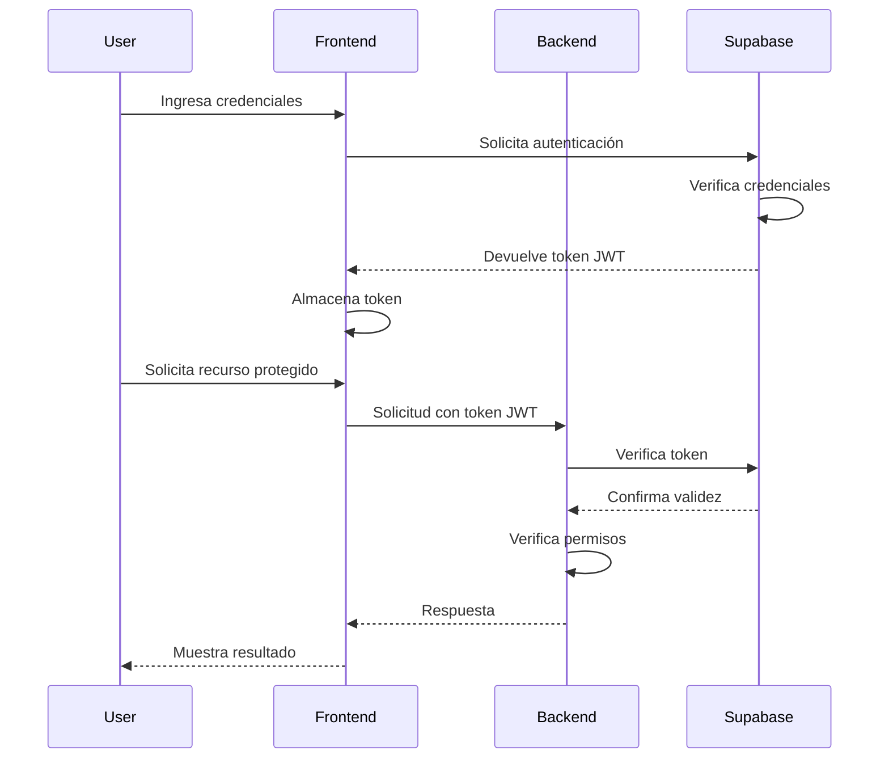

# Guía de Autenticación

## Visión General

El sistema de automatización de llamadas implementa un robusto sistema de autenticación y autorización utilizando Supabase como proveedor de identidad. Esta guía describe la arquitectura de autenticación, los flujos de autenticación soportados, la gestión de roles y permisos, y las mejores prácticas para implementar y utilizar el sistema de autenticación.

## Arquitectura de Autenticación

El sistema utiliza una arquitectura de autenticación basada en tokens JWT (JSON Web Tokens) con Supabase como proveedor de identidad:



## Métodos de Autenticación

El sistema soporta los siguientes métodos de autenticación:

### 1. Email y Contraseña

```javascript
// En el frontend (Next.js)
import { supabase } from '@/lib/supabase-client';

async function signInWithEmail(email, password) {
  const { data, error } = await supabase.auth.signInWithPassword({
    email,
    password,
  });
  
  if (error) {
    throw error;
  }
  
  return data;
}
```

### 2. Autenticación con Proveedores OAuth

```javascript
// En el frontend (Next.js)
import { supabase } from '@/lib/supabase-client';

async function signInWithGoogle() {
  const { data, error } = await supabase.auth.signInWithOAuth({
    provider: 'google',
    options: {
      redirectTo: `${window.location.origin}/auth/callback`,
    },
  });
  
  if (error) {
    throw error;
  }
  
  return data;
}
```

### 3. Autenticación de Dos Factores (2FA)

```javascript
// En el frontend (Next.js)
import { supabase } from '@/lib/supabase-client';

// Paso 1: Iniciar sesión con email y contraseña
async function signInWithEmail(email, password) {
  const { data, error } = await supabase.auth.signInWithPassword({
    email,
    password,
  });
  
  if (error) {
    throw error;
  }
  
  return data;
}

// Paso 2: Verificar código 2FA
async function verifyOTP(email, token) {
  const { data, error } = await supabase.auth.verifyOTP({
    email,
    token,
    type: 'totp',
  });
  
  if (error) {
    throw error;
  }
  
  return data;
}
```

### 4. Magic Link (Sin Contraseña)

```javascript
// En el frontend (Next.js)
import { supabase } from '@/lib/supabase-client';

async function signInWithMagicLink(email) {
  const { data, error } = await supabase.auth.signInWithOtp({
    email,
    options: {
      emailRedirectTo: `${window.location.origin}/auth/callback`,
    },
  });
  
  if (error) {
    throw error;
  }
  
  return data;
}
```

## Gestión de Sesiones

### Almacenamiento de Tokens

Los tokens JWT se almacenan de forma segura:

- **Frontend**: LocalStorage o cookies HttpOnly
- **Mobile**: Almacenamiento seguro del dispositivo

### Renovación de Tokens

```javascript
// En el frontend (Next.js)
import { supabase } from '@/lib/supabase-client';

// Configuración de renovación automática
supabase.auth.onAuthStateChange((event, session) => {
  if (event === 'TOKEN_REFRESHED') {
    console.log('Token refreshed automatically');
  }
});

// Renovación manual si es necesario
async function refreshToken() {
  const { data, error } = await supabase.auth.refreshSession();
  
  if (error) {
    throw error;
  }
  
  return data;
}
```

### Cierre de Sesión

```javascript
// En el frontend (Next.js)
import { supabase } from '@/lib/supabase-client';

async function signOut() {
  const { error } = await supabase.auth.signOut();
  
  if (error) {
    throw error;
  }
}
```

## Roles y Permisos

El sistema implementa un modelo de control de acceso basado en roles (RBAC) con los siguientes roles predefinidos:

### Roles Predefinidos

1. **Admin**: Acceso completo a todas las funcionalidades
2. **Operator**: Puede gestionar campañas y llamadas, pero no puede acceder a configuraciones del sistema
3. **Viewer**: Solo puede ver información, sin capacidad de modificación

### Definición de Roles en Supabase

```sql
-- Crear tabla de roles
CREATE TABLE IF NOT EXISTS roles (
  id TEXT PRIMARY KEY,
  description TEXT NOT NULL
);

-- Insertar roles predefinidos
INSERT INTO roles (id, description) VALUES
  ('admin', 'Acceso completo al sistema'),
  ('operator', 'Gestión de campañas y llamadas'),
  ('viewer', 'Solo lectura');

-- Añadir campo de rol a la tabla de usuarios
ALTER TABLE auth.users ADD COLUMN IF NOT EXISTS role TEXT REFERENCES roles(id) DEFAULT 'viewer';
```

### Verificación de Roles en el Backend

```python
# En app/middleware/auth.py
from fastapi import Depends, HTTPException, status
from fastapi.security import HTTPBearer, HTTPAuthorizationCredentials
from app.config.supabase import supabase_client

security = HTTPBearer()

async def get_current_user(credentials: HTTPAuthorizationCredentials = Depends(security)):
    """
    Verifica el token JWT y devuelve el usuario actual.
    """
    try:
        # Verificar token con Supabase
        user = supabase_client.auth.get_user(credentials.credentials)
        return user
    except Exception as e:
        raise HTTPException(
            status_code=status.HTTP_401_UNAUTHORIZED,
            detail="Invalid authentication credentials",
            headers={"WWW-Authenticate": "Bearer"},
        )

async def get_user_role(user_id: str) -> str:
    """
    Obtiene el rol de un usuario.
    """
    result = supabase_client.from_("users").select("role").eq("id", user_id).execute()
    
    if not result.data:
        return "viewer"  # Rol por defecto
    
    return result.data[0]["role"]

async def require_role(required_roles: list[str]):
    """
    Dependencia para requerir roles específicos.
    """
    async def dependency(user = Depends(get_current_user)):
        user_role = await get_user_role(user.id)
        
        if user_role not in required_roles:
            raise HTTPException(
                status_code=status.HTTP_403_FORBIDDEN,
                detail="Insufficient permissions",
            )
        
        return user
    
    return dependency

# Uso en endpoints
@app.get("/api/v1/admin/settings")
async def get_settings(user = Depends(require_role(["admin"]))):
    # Solo accesible para administradores
    return {"settings": "..."}

@app.post("/api/v1/campaigns")
async def create_campaign(campaign: CampaignCreate, user = Depends(require_role(["admin", "operator"]))):
    # Accesible para administradores y operadores
    return {"campaign": "..."}
```

### Políticas de Seguridad en Supabase

```sql
-- Política para que los usuarios solo puedan ver sus propias campañas
CREATE POLICY "Users can view their own campaigns"
ON campaigns FOR SELECT
USING (auth.uid() = user_id);

-- Política para que los administradores puedan ver todas las campañas
CREATE POLICY "Admins can view all campaigns"
ON campaigns FOR SELECT
USING (
    EXISTS (
        SELECT 1 FROM users
        WHERE users.id = auth.uid()
        AND users.role = 'admin'
    )
);

-- Política para que solo administradores y operadores puedan crear campañas
CREATE POLICY "Only admins and operators can create campaigns"
ON campaigns FOR INSERT
WITH CHECK (
    EXISTS (
        SELECT 1 FROM users
        WHERE users.id = auth.uid()
        AND (users.role = 'admin' OR users.role = 'operator')
    )
);

-- Política para que solo administradores puedan eliminar campañas
CREATE POLICY "Only admins can delete campaigns"
ON campaigns FOR DELETE
USING (
    EXISTS (
        SELECT 1 FROM users
        WHERE users.id = auth.uid()
        AND users.role = 'admin'
    )
);
```

## Implementación en el Frontend

### Configuración del Cliente de Supabase

```typescript
// En lib/supabase-client.ts
import { createClient } from '@supabase/supabase-js';

const supabaseUrl = process.env.NEXT_PUBLIC_SUPABASE_URL!;
const supabaseAnonKey = process.env.NEXT_PUBLIC_SUPABASE_ANON_KEY!;

export const supabase = createClient(supabaseUrl, supabaseAnonKey);
```

### Proveedor de Autenticación

```tsx
// En providers/AuthProvider.tsx
import { createContext, useContext, useEffect, useState } from 'react';
import { Session, User } from '@supabase/supabase-js';
import { supabase } from '@/lib/supabase-client';

type AuthContextType = {
  session: Session | null;
  user: User | null;
  loading: boolean;
  signIn: (email: string, password: string) => Promise<void>;
  signOut: () => Promise<void>;
  userRole: string | null;
};

const AuthContext = createContext<AuthContextType | undefined>(undefined);

export function AuthProvider({ children }: { children: React.ReactNode }) {
  const [session, setSession] = useState<Session | null>(null);
  const [user, setUser] = useState<User | null>(null);
  const [loading, setLoading] = useState(true);
  const [userRole, setUserRole] = useState<string | null>(null);

  useEffect(() => {
    // Obtener sesión inicial
    supabase.auth.getSession().then(({ data: { session } }) => {
      setSession(session);
      setUser(session?.user ?? null);
      
      if (session?.user) {
        fetchUserRole(session.user.id);
      }
      
      setLoading(false);
    });

    // Escuchar cambios de autenticación
    const { data: { subscription } } = supabase.auth.onAuthStateChange(
      (_event, session) => {
        setSession(session);
        setUser(session?.user ?? null);
        
        if (session?.user) {
          fetchUserRole(session.user.id);
        } else {
          setUserRole(null);
        }
        
        setLoading(false);
      }
    );

    return () => {
      subscription.unsubscribe();
    };
  }, []);

  async function fetchUserRole(userId: string) {
    const { data, error } = await supabase
      .from('users')
      .select('role')
      .eq('id', userId)
      .single();
    
    if (!error && data) {
      setUserRole(data.role);
    }
  }

  async function signIn(email: string, password: string) {
    const { error } = await supabase.auth.signInWithPassword({
      email,
      password,
    });
    
    if (error) {
      throw error;
    }
  }

  async function signOut() {
    const { error } = await supabase.auth.signOut();
    
    if (error) {
      throw error;
    }
  }

  const value = {
    session,
    user,
    loading,
    signIn,
    signOut,
    userRole,
  };

  return <AuthContext.Provider value={value}>{children}</AuthContext.Provider>;
}

export function useAuth() {
  const context = useContext(AuthContext);
  
  if (context === undefined) {
    throw new Error('useAuth must be used within an AuthProvider');
  }
  
  return context;
}
```

### Protección de Rutas

```tsx
// En components/ProtectedRoute.tsx
import { useRouter } from 'next/router';
import { useEffect } from 'react';
import { useAuth } from '@/providers/AuthProvider';

type ProtectedRouteProps = {
  children: React.ReactNode;
  requiredRoles?: string[];
};

export function ProtectedRoute({ children, requiredRoles = [] }: ProtectedRouteProps) {
  const { user, loading, userRole } = useAuth();
  const router = useRouter();

  useEffect(() => {
    if (!loading) {
      // Redirigir si no hay usuario autenticado
      if (!user) {
        router.push('/login');
        return;
      }
      
      // Verificar rol si se requiere
      if (requiredRoles.length > 0 && userRole && !requiredRoles.includes(userRole)) {
        router.push('/unauthorized');
      }
    }
  }, [user, loading, userRole, requiredRoles, router]);

  // Mostrar pantalla de carga mientras se verifica la autenticación
  if (loading || !user || (requiredRoles.length > 0 && !userRole)) {
    return <div>Loading...</div>;
  }
  
  // Verificar permisos
  if (requiredRoles.length > 0 && userRole && !requiredRoles.includes(userRole)) {
    return null;
  }

  return <>{children}</>;
}
```

### Uso en Páginas

```tsx
// En pages/admin/settings.tsx
import { ProtectedRoute } from '@/components/ProtectedRoute';
import { SettingsForm } from '@/components/SettingsForm';

export default function SettingsPage() {
  return (
    <ProtectedRoute requiredRoles={['admin']}>
      <h1>Settings</h1>
      <SettingsForm />
    </ProtectedRoute>
  );
}

// En pages/campaigns/index.tsx
import { ProtectedRoute } from '@/components/ProtectedRoute';
import { CampaignList } from '@/components/CampaignList';

export default function CampaignsPage() {
  return (
    <ProtectedRoute requiredRoles={['admin', 'operator', 'viewer']}>
      <h1>Campaigns</h1>
      <CampaignList />
    </ProtectedRoute>
  );
}
```

## Gestión de Usuarios

### Creación de Usuarios

```typescript
// En services/userService.ts
import { supabase } from '@/lib/supabase-client';

export async function createUser(email: string, password: string, role: string = 'viewer') {
  // Solo administradores pueden crear usuarios
  const { data: { user }, error: signUpError } = await supabase.auth.signUp({
    email,
    password,
  });
  
  if (signUpError || !user) {
    throw signUpError || new Error('Failed to create user');
  }
  
  // Asignar rol al usuario
  const { error: updateError } = await supabase
    .from('users')
    .update({ role })
    .eq('id', user.id);
  
  if (updateError) {
    throw updateError;
  }
  
  return user;
}
```

### Gestión de Roles

```typescript
// En services/userService.ts
import { supabase } from '@/lib/supabase-client';

export async function updateUserRole(userId: string, role: string) {
  const { error } = await supabase
    .from('users')
    .update({ role })
    .eq('id', userId);
  
  if (error) {
    throw error;
  }
}

export async function getUserRole(userId: string) {
  const { data, error } = await supabase
    .from('users')
    .select('role')
    .eq('id', userId)
    .single();
  
  if (error) {
    throw error;
  }
  
  return data.role;
}
```

### Desactivación de Usuarios

```typescript
// En services/userService.ts
import { supabase } from '@/lib/supabase-client';

export async function deactivateUser(userId: string) {
  // Marcar como inactivo en la tabla de usuarios
  const { error } = await supabase
    .from('users')
    .update({ is_active: false })
    .eq('id', userId);
  
  if (error) {
    throw error;
  }
}
```

## Seguridad Adicional

### Protección Contra CSRF

```typescript
// En middleware.ts (Next.js)
import { NextResponse } from 'next/server';
import type { NextRequest } from 'next/server';

export function middleware(request: NextRequest) {
  // Verificar origen para protección CSRF
  const origin = request.headers.get('origin');
  const allowedOrigins = ['https://example.com', 'https://www.example.com'];
  
  if (request.method !== 'GET' && origin && !allowedOrigins.includes(origin)) {
    return new NextResponse(null, {
      status: 403,
      statusText: 'Forbidden',
      headers: {
        'Content-Type': 'text/plain',
      },
    });
  }
  
  return NextResponse.next();
}

export const config = {
  matcher: '/api/:path*',
};
```

### Limitación de Tasa para Autenticación

```typescript
// En pages/api/auth/[...supabase].ts
import { createMiddlewareSupabaseClient } from '@supabase/auth-helpers-nextjs';
import { NextApiRequest, NextApiResponse } from 'next';
import { Redis } from '@upstash/redis';

const redis = new Redis({
  url: process.env.REDIS_URL!,
  token: process.env.REDIS_TOKEN!,
});

const MAX_ATTEMPTS = 5;
const LOCKOUT_TIME = 15 * 60; // 15 minutos en segundos

export default async function handler(req: NextApiRequest, res: NextApiResponse) {
  const supabase = createMiddlewareSupabaseClient({ req, res });
  
  // Implementar rate limiting para intentos de inicio de sesión
  if (req.method === 'POST' && req.body?.email) {
    const email = req.body.email;
    const ip = req.headers['x-forwarded-for'] || req.socket.remoteAddress;
    const key = `auth:${email}:${ip}`;
    
    // Verificar si está bloqueado
    const lockUntil = await redis.get(`${key}:lockUntil`);
    if (lockUntil && parseInt(lockUntil as string) > Math.floor(Date.now() / 1000)) {
      return res.status(429).json({
        error: 'Too many login attempts. Please try again later.',
      });
    }
    
    // Incrementar contador de intentos
    const attempts = await redis.incr(key);
    await redis.expire(key, 60 * 60); // Expirar en 1 hora
    
    // Bloquear después de demasiados intentos
    if (attempts > MAX_ATTEMPTS) {
      const lockUntil = Math.floor(Date.now() / 1000) + LOCKOUT_TIME;
      await redis.set(`${key}:lockUntil`, lockUntil.toString());
      await redis.expire(`${key}:lockUntil`, LOCKOUT_TIME);
      
      return res.status(429).json({
        error: 'Too many login attempts. Please try again later.',
      });
    }
  }
  
  // Continuar con la autenticación normal
  // ...
}
```

### Auditoría de Acceso

```sql
-- Crear tabla de auditoría
CREATE TABLE auth_audit_log (
  id UUID PRIMARY KEY DEFAULT uuid_generate_v4(),
  user_id UUID REFERENCES auth.users(id),
  event_type TEXT NOT NULL,
  ip_address TEXT,
  user_agent TEXT,
  metadata JSONB,
  created_at TIMESTAMP WITH TIME ZONE DEFAULT NOW()
);

-- Función para registrar eventos de auditoría
CREATE OR REPLACE FUNCTION log_auth_event()
RETURNS TRIGGER AS $$
BEGIN
  INSERT INTO auth_audit_log (user_id, event_type, ip_address, user_agent, metadata)
  VALUES (
    NEW.id,
    TG_ARGV[0],
    current_setting('request.headers')::json->>'x-forwarded-for',
    current_setting('request.headers')::json->>'user-agent',
    jsonb_build_object('email', NEW.email)
  );
  RETURN NEW;
END;
$$ LANGUAGE plpgsql SECURITY DEFINER;

-- Trigger para nuevos inicios de sesión
CREATE TRIGGER on_auth_sign_in
AFTER INSERT ON auth.sessions
FOR EACH ROW
EXECUTE FUNCTION log_auth_event('sign_in');
```

## Mejores Prácticas

### 1. Seguridad de Contraseñas

- **Políticas de contraseñas**: Requerir contraseñas fuertes
- **Almacenamiento seguro**: Utilizar algoritmos de hash seguros (bcrypt)
- **Cambio periódico**: Forzar cambio de contraseñas cada cierto tiempo
- **Historial de contraseñas**: Evitar reutilización de contraseñas

### 2. Gestión de Sesiones

- **Tiempo de expiración**: Configurar tiempos de expiración adecuados
- **Renovación segura**: Implementar renovación segura de tokens
- **Invalidación**: Permitir invalidar todas las sesiones activas
- **Detección de anomalías**: Detectar accesos desde ubicaciones inusuales

### 3. Autenticación Multifactor

- **Obligatoria para roles críticos**: Requerir 2FA para administradores
- **Opciones múltiples**: Ofrecer diferentes métodos (SMS, TOTP, etc.)
- **Recuperación**: Implementar mecanismos de recuperación seguros
- **Recordar dispositivos**: Permitir recordar dispositivos confiables

### 4. Auditoría y Monitoreo

- **Registro de eventos**: Registrar todos los eventos de autenticación
- **Alertas**: Configurar alertas para actividades sospechosas
- **Revisión periódica**: Revisar logs de autenticación regularmente
- **Retención**: Mantener logs durante el tiempo requerido por normativas

## Solución de Problemas

### Problemas Comunes

1. **Token expirado**:
   - Implementar renovación automática de tokens
   - Redirigir a la página de login cuando se detecta token expirado

2. **Permisos insuficientes**:
   - Verificar asignación de roles
   - Comprobar políticas de seguridad en Supabase

3. **Bloqueo de cuenta**:
   - Implementar mecanismo de desbloqueo
   - Notificar al usuario por email

4. **Problemas con 2FA**:
   - Proporcionar códigos de recuperación
   - Ofrecer métodos alternativos de autenticación

### Comandos Útiles

```bash
# Verificar políticas de seguridad en Supabase
psql -h db.example.supabase.co -p 5432 -d postgres -U postgres -c "SELECT * FROM pg_policies;"

# Verificar roles de usuario
psql -h db.example.supabase.co -p 5432 -d postgres -U postgres -c "SELECT * FROM users WHERE email = 'user@example.com';"

# Verificar logs de auditoría
psql -h db.example.supabase.co -p 5432 -d postgres -U postgres -c "SELECT * FROM auth_audit_log ORDER BY created_at DESC LIMIT 10;"
```

## Referencias

- [Supabase Auth Documentation](https://supabase.io/docs/guides/auth)
- [JWT.io](https://jwt.io/)
- [OWASP Authentication Cheat Sheet](https://cheatsheetseries.owasp.org/cheatsheets/Authentication_Cheat_Sheet.html)
- [NIST Digital Identity Guidelines](https://pages.nist.gov/800-63-3/)
- [FastAPI Security](https://fastapi.tiangolo.com/tutorial/security/)
- [Next.js Authentication](https://nextjs.org/docs/authentication)
