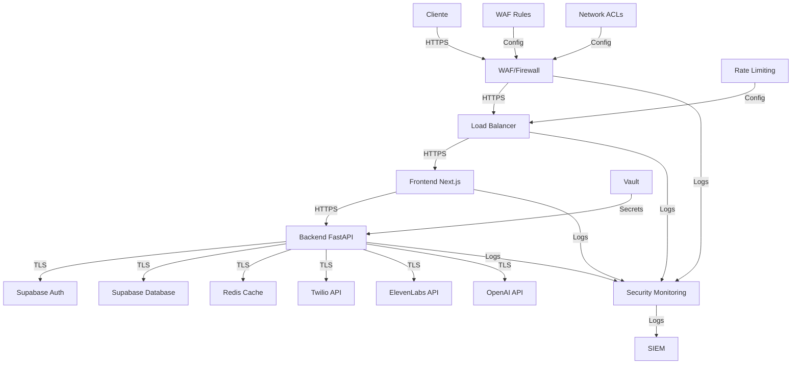

# Visión General de Seguridad

## Introducción

La seguridad es un aspecto fundamental del sistema de automatización de llamadas, especialmente considerando que maneja datos sensibles de contactos, grabaciones de llamadas y credenciales de servicios externos. Este documento proporciona una visión general de la arquitectura de seguridad del sistema, las medidas implementadas y las mejores prácticas recomendadas.

## Principios de Seguridad

El sistema se ha diseñado siguiendo estos principios fundamentales de seguridad:

1. **Defensa en Profundidad**: Múltiples capas de seguridad para proteger los datos y servicios
2. **Privilegio Mínimo**: Acceso limitado a lo estrictamente necesario para cada componente
3. **Seguridad por Diseño**: Consideraciones de seguridad desde las primeras etapas del diseño
4. **Datos Sensibles Protegidos**: Protección especial para datos personales y credenciales
5. **Monitoreo Continuo**: Detección temprana de posibles problemas de seguridad
6. **Actualizaciones Regulares**: Mantenimiento al día de dependencias y componentes

## Arquitectura de Seguridad

### Diagrama de Arquitectura de Seguridad



## Componentes de Seguridad

### 1. Autenticación y Autorización

El sistema utiliza Supabase para la gestión de autenticación y autorización:

- **Autenticación de Usuarios**: Email/contraseña, OAuth, autenticación de dos factores
- **Gestión de Sesiones**: Tokens JWT con tiempo de expiración configurable
- **Control de Acceso Basado en Roles (RBAC)**: Roles predefinidos (admin, operator, viewer)
- **Políticas de Seguridad**: Políticas a nivel de base de datos para control de acceso granular

### 2. Protección de Datos

- **Cifrado en Tránsito**: TLS 1.3 para todas las comunicaciones
- **Cifrado en Reposo**: Cifrado de datos sensibles en la base de datos
- **Enmascaramiento de Datos**: Enmascaramiento de información sensible en logs y UI
- **Sanitización de Entrada**: Validación y sanitización de todas las entradas de usuario
- **Gestión de Datos Personales**: Cumplimiento con regulaciones de privacidad (GDPR, CCPA)

### 3. Gestión de Secretos

- **HashiCorp Vault**: Almacenamiento seguro de secretos y credenciales
- **Rotación de Secretos**: Rotación automática de credenciales
- **Acceso Controlado**: Acceso a secretos basado en políticas
- **Auditoría de Acceso**: Registro de todos los accesos a secretos

### 4. Seguridad de API

- **Autenticación de API**: Tokens JWT para autenticación de API
- **Rate Limiting**: Limitación de tasa para prevenir abusos
- **Validación de Entrada**: Validación estricta de todos los parámetros de API
- **Cabeceras de Seguridad**: Implementación de cabeceras de seguridad HTTP
- **CORS**: Configuración restrictiva de Cross-Origin Resource Sharing

### 5. Seguridad de Infraestructura

- **Firewall**: Reglas de firewall para limitar el acceso
- **WAF**: Web Application Firewall para protección contra ataques comunes
- **Network ACLs**: Listas de control de acceso a nivel de red
- **Segmentación**: Segmentación de red para aislar componentes
- **Bastionado**: Configuración segura de servidores y contenedores

### 6. Monitoreo y Detección

- **Logging Centralizado**: Recopilación centralizada de logs
- **Monitoreo de Seguridad**: Detección de actividades sospechosas
- **Alertas**: Alertas en tiempo real para eventos de seguridad
- **Análisis de Vulnerabilidades**: Escaneo regular de vulnerabilidades
- **Pruebas de Penetración**: Pruebas periódicas de seguridad

## Implementación de Seguridad

### Autenticación con Supabase

```python
# En app/config/auth.py
from fastapi import Depends, HTTPException, status
from fastapi.security import HTTPBearer, HTTPAuthorizationCredentials
from supabase import Client
from app.config.supabase import supabase_client

security = HTTPBearer()

async def get_current_user(credentials: HTTPAuthorizationCredentials = Depends(security)):
    """
    Verifica el token JWT y devuelve el usuario actual.
    """
    try:
        # Verificar token con Supabase
        user = supabase_client.auth.get_user(credentials.credentials)
        return user
    except Exception as e:
        raise HTTPException(
            status_code=status.HTTP_401_UNAUTHORIZED,
            detail="Invalid authentication credentials",
            headers={"WWW-Authenticate": "Bearer"},
        )

async def get_admin_user(user = Depends(get_current_user)):
    """
    Verifica que el usuario actual sea administrador.
    """
    # Obtener rol del usuario
    result = supabase_client.from_("users").select("role").eq("id", user.id).execute()

    if not result.data or result.data[0]["role"] != "admin":
        raise HTTPException(
            status_code=status.HTTP_403_FORBIDDEN,
            detail="Insufficient permissions",
        )

    return user
```

### Políticas de Seguridad en Supabase

```sql
-- Política para que los usuarios solo puedan ver sus propias campañas
CREATE POLICY "Users can view their own campaigns"
ON campaigns FOR SELECT
USING (auth.uid() = user_id);

-- Política para que los administradores puedan ver todas las campañas
CREATE POLICY "Admins can view all campaigns"
ON campaigns FOR SELECT
USING (
    EXISTS (
        SELECT 1 FROM users
        WHERE users.id = auth.uid()
        AND users.role = 'admin'
    )
);

-- Política para proteger datos sensibles de contactos
CREATE POLICY "Restrict access to contact data"
ON contacts FOR SELECT
USING (
    EXISTS (
        SELECT 1 FROM users
        WHERE users.id = auth.uid()
        AND (users.role = 'admin' OR users.role = 'operator')
    )
);
```

### Gestión de Secretos con Vault

```python
# En app/config/secrets.py
import hvac
import os
from typing import Dict, Any

class SecretsManager:
    """
    Gestor de secretos utilizando HashiCorp Vault.
    """

    def __init__(self):
        """
        Inicializa el cliente de Vault.
        """
        self.client = hvac.Client(
            url=os.getenv("VAULT_ADDR", "http://vault:8200"),
            token=self._get_vault_token()
        )
        self.mount_point = os.getenv("VAULT_MOUNT_POINT", "kv")
        self.path = os.getenv("VAULT_PATH", "call-automation")

    def _get_vault_token(self) -> str:
        """
        Obtiene el token de Vault desde un archivo o variable de entorno.
        """
        token_file = os.getenv("VAULT_TOKEN_FILE")
        if token_file and os.path.exists(token_file):
            with open(token_file, "r") as f:
                return f.read().strip()
        return os.getenv("VAULT_TOKEN", "")

    async def get_secret(self, key: str) -> Dict[str, Any]:
        """
        Obtiene un secreto de Vault.
        """
        try:
            response = self.client.secrets.kv.v2.read_secret_version(
                mount_point=self.mount_point,
                path=f"{self.path}/{key}"
            )
            return response["data"]["data"]
        except Exception as e:
            logger.error(f"Error al obtener secreto {key}: {str(e)}")
            return {}

    async def get_twilio_credentials(self) -> Dict[str, str]:
        """
        Obtiene las credenciales de Twilio.
        """
        return await self.get_secret("twilio")

    async def get_elevenlabs_credentials(self) -> Dict[str, str]:
        """
        Obtiene las credenciales de ElevenLabs.
        """
        return await self.get_secret("elevenlabs")

    async def get_openai_credentials(self) -> Dict[str, str]:
        """
        Obtiene las credenciales de OpenAI.
        """
        return await self.get_secret("openai")
```

### Cabeceras de Seguridad HTTP

```python
# En app/main.py
from fastapi.middleware.trustedhost import TrustedHostMiddleware
from fastapi.middleware.httpsredirect import HTTPSRedirectMiddleware
from fastapi.middleware.cors import CORSMiddleware

# Redirigir HTTP a HTTPS
app.add_middleware(HTTPSRedirectMiddleware)

# Restringir hosts permitidos
app.add_middleware(
    TrustedHostMiddleware, allowed_hosts=["example.com", "*.example.com"]
)

# Configurar CORS
app.add_middleware(
    CORSMiddleware,
    allow_origins=["https://example.com"],
    allow_credentials=True,
    allow_methods=["*"],
    allow_headers=["*"],
)

# Middleware para cabeceras de seguridad
@app.middleware("http")
async def add_security_headers(request, call_next):
    response = await call_next(request)
    response.headers["X-Content-Type-Options"] = "nosniff"
    response.headers["X-Frame-Options"] = "DENY"
    response.headers["X-XSS-Protection"] = "1; mode=block"
    response.headers["Strict-Transport-Security"] = "max-age=31536000; includeSubDomains"
    response.headers["Content-Security-Policy"] = "default-src 'self'; script-src 'self'; img-src 'self' data:; style-src 'self' 'unsafe-inline'; font-src 'self'; connect-src 'self' https://api.example.com;"
    return response
```

### Rate Limiting

```python
# En app/middleware/rate_limit.py
from fastapi import Request, HTTPException
import time
from typing import Dict, Tuple
import redis

# Cliente Redis para almacenar contadores
redis_client = redis.Redis.from_url(os.getenv("REDIS_URL"))

class RateLimiter:
    """
    Implementación de rate limiting utilizando el algoritmo de ventana deslizante.
    """

    def __init__(self, requests_per_minute: int = 60):
        """
        Inicializa el rate limiter.

        Args:
            requests_per_minute: Número máximo de solicitudes por minuto
        """
        self.requests_per_minute = requests_per_minute
        self.window_size = 60  # segundos

    async def is_rate_limited(self, key: str) -> Tuple[bool, int]:
        """
        Verifica si una clave está limitada por tasa.

        Args:
            key: Clave única para identificar al cliente

        Returns:
            Tuple[bool, int]: (está_limitado, límite_restante)
        """
        current_time = int(time.time())
        window_key = f"rate_limit:{key}:{current_time // self.window_size}"

        # Incrementar contador en la ventana actual
        count = redis_client.incr(window_key)

        # Establecer TTL si es la primera solicitud en esta ventana
        if count == 1:
            redis_client.expire(window_key, self.window_size * 2)

        # Verificar si se ha superado el límite
        if count > self.requests_per_minute:
            return True, 0

        return False, self.requests_per_minute - count

# Middleware de FastAPI para rate limiting
async def rate_limit_middleware(request: Request, call_next):
    """
    Middleware para aplicar rate limiting.
    """
    # Obtener IP del cliente o token de API como clave
    client_key = request.client.host
    if "Authorization" in request.headers:
        client_key = request.headers["Authorization"]

    # Diferentes límites según la ruta
    if request.url.path.startswith("/api/v1/calls"):
        limiter = RateLimiter(requests_per_minute=30)
    else:
        limiter = RateLimiter(requests_per_minute=60)

    # Verificar límite
    is_limited, remaining = await limiter.is_rate_limited(client_key)

    if is_limited:
        raise HTTPException(
            status_code=429,
            detail="Too many requests",
            headers={"Retry-After": "60", "X-RateLimit-Remaining": "0"}
        )

    # Continuar con la solicitud
    response = await call_next(request)

    # Añadir cabeceras de rate limiting
    response.headers["X-RateLimit-Limit"] = str(limiter.requests_per_minute)
    response.headers["X-RateLimit-Remaining"] = str(remaining)

    return response
```

## Mejores Prácticas de Seguridad

### 1. Gestión de Credenciales

- **No almacenar credenciales en código**: Utilizar variables de entorno o gestores de secretos
- **Rotación regular**: Cambiar credenciales periódicamente
- **Credenciales únicas**: Utilizar credenciales diferentes para cada entorno
- **Principio de privilegio mínimo**: Asignar solo los permisos necesarios

### 2. Desarrollo Seguro

- **Análisis estático de código**: Utilizar herramientas como Snyk, SonarQube
- **Revisión de código**: Implementar revisión de código obligatoria
- **Pruebas de seguridad**: Incluir pruebas de seguridad en CI/CD
- **Gestión de dependencias**: Mantener dependencias actualizadas

### 3. Protección de Datos

- **Clasificación de datos**: Clasificar datos según su sensibilidad
- **Minimización de datos**: Recopilar solo los datos necesarios
- **Retención de datos**: Implementar políticas de retención
- **Anonimización**: Anonimizar datos cuando sea posible

### 4. Operaciones Seguras

- **Bastionado de sistemas**: Configurar sistemas siguiendo guías de bastionado
- **Gestión de parches**: Mantener sistemas actualizados
- **Monitoreo continuo**: Implementar monitoreo de seguridad
- **Respuesta a incidentes**: Tener un plan de respuesta a incidentes

## Cumplimiento Normativo

El sistema está diseñado para cumplir con las siguientes regulaciones:

- **GDPR**: Protección de datos personales en la UE
- **CCPA**: Protección de datos personales en California
- **PCI DSS**: Si se procesan datos de tarjetas de pago
- **HIPAA**: Si se manejan datos de salud
- **Regulaciones de telecomunicaciones**: Cumplimiento con regulaciones locales

## Plan de Respuesta a Incidentes

En caso de un incidente de seguridad, se debe seguir el siguiente proceso:

1. **Detección**: Identificar y confirmar el incidente
2. **Contención**: Limitar el impacto del incidente
3. **Erradicación**: Eliminar la causa raíz
4. **Recuperación**: Restaurar sistemas y datos
5. **Lecciones aprendidas**: Analizar el incidente y mejorar procesos

## Auditoría y Logging

El sistema implementa logging exhaustivo para fines de auditoría:

- **Acciones de usuarios**: Registro de todas las acciones de usuarios
- **Cambios de configuración**: Registro de cambios en la configuración
- **Acceso a datos sensibles**: Registro de acceso a datos sensibles
- **Eventos de seguridad**: Registro de eventos relacionados con la seguridad
- **Logs inmutables**: Protección contra manipulación de logs

## Referencias

- [OWASP Top 10](https://owasp.org/www-project-top-ten/)
- [NIST Cybersecurity Framework](https://www.nist.gov/cyberframework)
- [GDPR](https://gdpr.eu/)
- [CCPA](https://oag.ca.gov/privacy/ccpa)
- [PCI DSS](https://www.pcisecuritystandards.org/)
- [HIPAA](https://www.hhs.gov/hipaa/index.html)
- [HashiCorp Vault Documentation](https://www.vaultproject.io/docs)
- [Supabase Security](https://supabase.io/docs/guides/auth)
